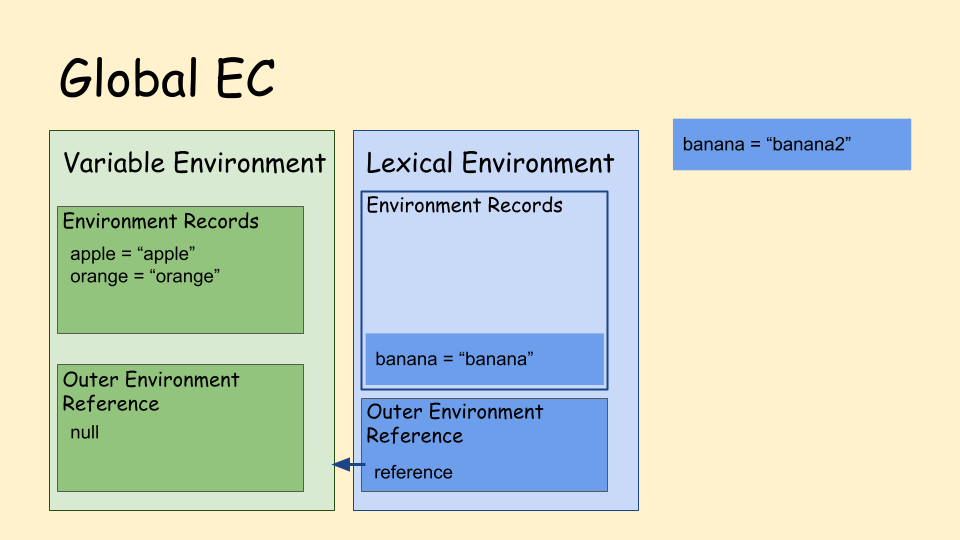

실행 컨텍스트는 자바스크립트에서 가장 중요한 핵심 개념 중 하나로, **실행할 코드에 제공할 환경 정보들을 모아놓은 객체**입니다.
동일한 환경에 있는 코드들을 실행할 때 필요한 환경 정보들을 모아 컨텍스트를 구성하고 이를 콜 스택에 쌓아올렸다가, 가장 위에 있는 컨텍스트를 실행하는 식으로 전체 코드의 환경과 순서를 보장합니다.
여기서 '동일한 환경', 즉 하나의 실행 컨텍스트를 구성할 수 있는 방법으로 전역공간, eval() 함수, 함수 등이 있습니다. 자동으로 생성되는 전역공간과 악마로 취급받는 eval을 제외하면 우리가 흔히 실행 컨텍스트를 구성하는 방법은 **함수를 실행**하는 것 뿐입니다.

<!--truncate-->

한 실행 컨텍스트가 콜 스택의 맨 위에 쌓이는 순간이 곧 현재 실행할 코드에 관여하게 되는 시점입니다. 자바스크립트 엔진은 해당 컨텍스트에 관련된 코드들을 실행하는 데 필요한 환경 정보들을 수집해서 실행 컨텍스트 객체에 저장합니다. 이 객체는 자바스크립트 엔진이 활용할 목적으로 생성할 뿐 개발자가 코드를 통해 확인할 수는 없습니다. 여기에 담기는 정보들은 다음과 같습니다.

- VariableEnvironment: 현재 컨텍스트 내의 식별자들에 대한 정보 + 외부 환경 정보, 선언 시점의 LexicalEnvironment의 스냅샷으로, 변경 사항은 반영되지 않음.
- LexicalEnvironment: 처음에는 VariableEnvironment와 같지만 변경 사항이 실시간으로 반영됨.
- ThisBinding: this 식별자가 바라봐야 할 대상 객체.

|                     |                                        |
| :-----------------: | :------------------------------------- |
| VariableEnvironment | - environmentRecord (snapshot)         |
|                     | - outerEnvironmentReference (snapshot) |
| LexicalEnvironment  | - environmentRecord                    |
|                     | - outerEnvironmentReference            |
|     ThisBinding     |                                        |

## Lexical Environment

Lexical Environment는 자바스크립트 코드에서 변수나 함수 등의 식별자를 정의하는데 사용하는 객체로 생각하면 쉽습니다. Lexical Environment는 식별자와 참조 혹은 값을 기록하는 `environmentRecode`와 `outerEnvironmentReference`라는 또 다른 Lexical Environment를 참조하는 포인터로 구성됩니다.

### Environment Recode

`environmentRecode`는 현재 컨텍스트와 관련된 식별자 정보들이 저장됩니다. 컨텍스트를 구성하는 함수에 지정된 매개변수 식별자, 선언한 함수가 있을 경우 그 함수 자체, var로 선언된 변수의 식별자 등이 식별자에 해당합니다. 컨텍스트 내부 전체를 처음부터 끝까지 쭉 훑어나가며 순서대로 수집합니다. 변수 정보를 수집하는 과정을 모두 마쳤더라도 아직 실행 컨텍스트가 관여할 코드들은 실행도기 전의 상태입니다. 코드가 실행되기 전임에도 불구하고 자바스크립트 엔진은 이미 해당 환경에 속한 코드의 변수명들을 모두 알고 있게 되는 것이죠. 이러한 과정을 **Hoisting**이라고 합니다.

### Outer Environment Reference

`outerEnvironmentReference`는 외부 Lexical Environment를 참조하는 포인터로, 중첩된 자바스크립트 코드에서 스코프 탐색을 하기 위해 사용됩니다. (따라서 Global Execution Context의 `outerEnvironmentReference`는 null 입니다.)

## Variable Environment

VariableEnvironment에 담기는 내용은 LexicalEnvironment와 같지만 최초 실행 시의 스냅샷을 유지한다는 점이 다릅니다. 실행 컨텍스트를 생성할 때 VariableEnvironment에 정보를 먼저 담은 다음, 이를 그대로 복사해서 LexicalEnvironment를 만들고, 이후에는 LexicalEnvironment를 주로 활용하게 됩니다.

```js
executionContext.LexicalEnvironment = executionContext.VariableEnvironment;
```

### Variable Environment vs Lexical Environment

`Variable Environment`와 `Lexical Environment`를 조금 더 알아보겠습니다.

```js
var apple = "apple";
let banana = "banana";

{
  let banana = "banana2";
  var orange = "orange";
  console.log(apple, orange, banana);
}
```

처음에 `var` 키워드를 가진 변수들이 `Variable Environment`의 `Environment Records`에 등록이 됩니다. 그리고 Global EC 이기에 `Outer Environment Reference`는 null이 되게 됩니다.

그리고 `let` 키워드를 가진 변수들이 `Lexical Environment`의 Environment Records`에 등록이 됩니다.`var`키워드는 undefined로 초기화가 되는 반면에 `let` 키워드는 초기화가 되지않아 할당전 호출하게 되면 Reference Error가 발생하게 됩니다.


코드가 실행이 됨에 따라 각 변수에 값이 할당되게 됩니다.


이후 block scope를 만나게 되면 `Lexical Environment`의 `Environment Records`의 새로운 area를 만들어 기존과 다른 area에 식별자를 등록하게 됩니다. 그리고 이러한 area는 stack으로 관리하여 변수가 충하지 않습니다.


block scope가 실행이 되고 상위 area의 banana에 값이 할당됩니다.


이후 block scope의 실행이 끝나면 `Environment Records` block scope가 제거됩니다.



## ThisBinding

this에 대해서는 다른 포스트에서 다루도록 하겠습니다.

## Reference

- 코어 자바스크립트 (정재남 지음)
- [JavaScript execution context — lexical environment and block scope :: carson](https://cabulous.medium.com/javascript-execution-context-lexical-environment-and-block-scope-part-3-fc2551c92ce0)
