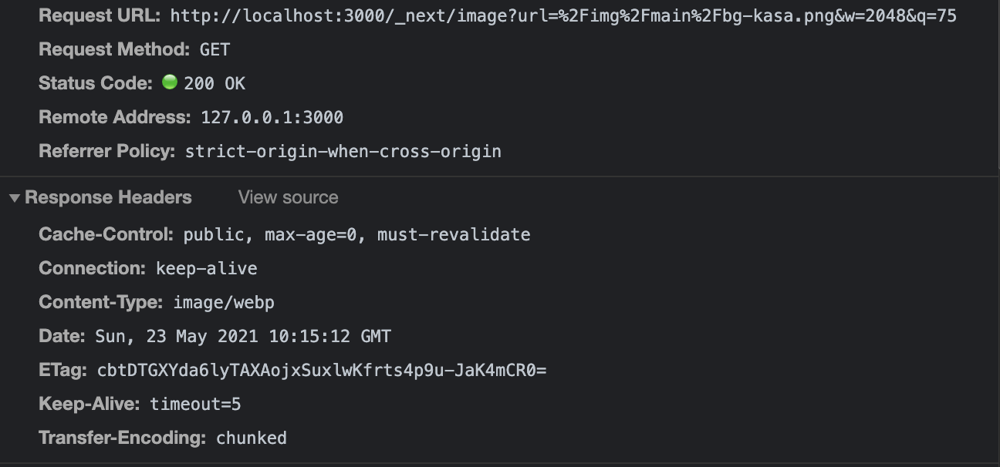
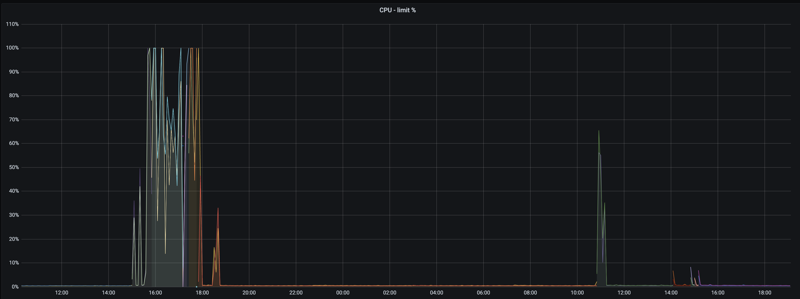
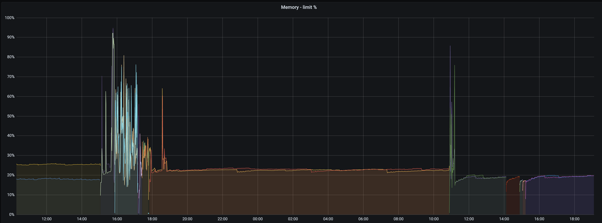

Brand site를 개발하며 SEO를 높히기 위해 기존 Vue.js로 되어있는 프로젝트를 next.js 로 프레임워크를 변경하는 작업을 진행한 경험이 있습니다. 이때 새로운 프레임워크로 Next.js를 선택한 배경으로는 새로운 v10이 나왔기도 했고, 가장 인기있는 프레임워크 중 하나이기 때문입니다.

Next.js가 이번 v10이 나오게 되면서 많은 기능들이 추가 되었는데, 그 중 가장 관심이 갔던게 [`next/image`](https://nextjs.org/blog/next-10#built-in-image-component-and-automatic-image-optimization) 입니다.

<!--truncate-->

```jsx
import Image from "next/image";

function Home() {
  return (
    <>
      <h1>My Homepage</h1>
      <Image
        src="/me.png"
        alt="Picture of the author"
        width={500}
        height={500}
      />
      <p>Welcome to my homepage!</p>
    </>
  );
}

export default Home;
```

`next/image`는 next.js에서 제공하는 이미지 최적화 컴포넌트입니다. `Static HTML Export`에서는 사용할 수 없는데, 그 이유는 Server에서 돌아가기 때문입니다.

### `next/image`가 수행하는 기능은 다음과 같습니다.

- webp 포멧으로 자동변환
- automatic lazy-loading
- correct sizing across devices

자동 이미지 최적화 기능이 매우 흥미로운데, image request가 들어올 때마다 device 크기별로 이미지 크기(image quality)를 조절해서 보내줍니다.



`next/image` header를 살펴보겠습니다.
실제 이미지는 `image/bg-kasa.png` path에 있지만 `_next/image` 로 요청된 것을 알 수 있습니다. query를 살펴보면 q=75 로 되어있는데 이는 image-quality를 75%로 보내달라는 것 입니다. 즉, 현재 viewport width가 크지 않으니 100% quality로 보내면 network상 손해이기 때문에 75%로 보내는 것 입니다. 그리고 업로드한 이미지는 파일포멧이 png인데, response headers를 보게되면 `Content-Type: image/webp` 인 것을 확인할 수 있습니다.(webp로 파일포멧 변경)

`next/image`를 사용하면 브라우저에서 지원하는 경우 WebP와 같은 최신 형식의 이미지로 변환하여 전송하고, 이미지 크기를 조정하고 최적화할 수 있습니다. 이렇게 하면 viewPort가 더 작은 장치로 큰 이미지가 전송되는 것을 막을 수 있습니다.

생성 가능한 총 이미지 수를 줄이기 위해 `deviceSizes` 및 `imageSizes`를 구성 할 수도 있습니다.

```js
module.exports = {
  images: {
    deviceSizes: [640, 750, 828, 1080, 1200, 1920, 2048, 3840],
    imageSizes: [16, 32, 48, 64, 96, 128, 256, 384],
  },
};
```

## memory leak

`next/image`에서 memory leak 문제가 지속적으로 제기 되었습니다.

- [https://github.com/vercel/next.js/issues/20915](https://github.com/vercel/next.js/issues/20915)
- [https://github.com/vercel/next.js/issues/23189](https://github.com/vercel/next.js/issues/23189)

`next/image`에 의해 최적화된 이미지는 만료일에 도달할 때까지 `<distDir>/cache../images`에 캐싱을 하고, 만료가 되면 캐싱된 이미지를 삭제하고 다시 최적화 이미지를 생성한 후 캐싱을 하는 기능이 있는데 이때 캐싱된 이미지를 삭제하는 라이브러리가 제대로 삭제를 시켜주지 않는 문제였습니다.

next.js 레포에 v9에서 v10으로 변경한 후 memory 사용량이 비정상적으로 높아졌으며 이로 인해 `next/image`의 image component를 제거해야만 했다라는 이슈가 계속 올라왔습니다.


이에 next.js에서는 캐싱하고 삭제하는 라이브러리와 로직을 계속 변경하고 테스트를 하는 중인 것 같습니다.(canary에서 memory-leak 관련 피쳐들이 계속 올라오고 있습니다.)

제가 이 문제를 알게된 이유도 현재 next 서버를 돌리고 있는 ecs(Amazon Elastic Container Services)의 cpu와 memory의 사용량이 비정상적인 경우가 존재하였고, image가 pending 상태로 제대로 받아지지 않고 ecs가 비정상적으로 종료되는 문제가 계속 발생했기 때문입니다.

다음은 제가 작업한 프로젝트에서 `next/image`를 사용했다가 제거한 후의 cpu, memory 사용량입니다. **5/11 15:30** 에 제거한 후 배포를 했는데 확연한 차이를 확인할 수 있습니다. (그래프가 요동치는 곳의 색깔이 화려한데 8개이상의 pod가 비정상적으로 종료되고 실행되었기 때문입니다.)





## 마무리

현재 next.js의 stable version은 v10.2.0 입니다. `next/image`는 분명히 좋은 기능이지만 위의 이슈가 해결되지 않는다면 production에서 사용하기에는 어려울 것 같습니다.
