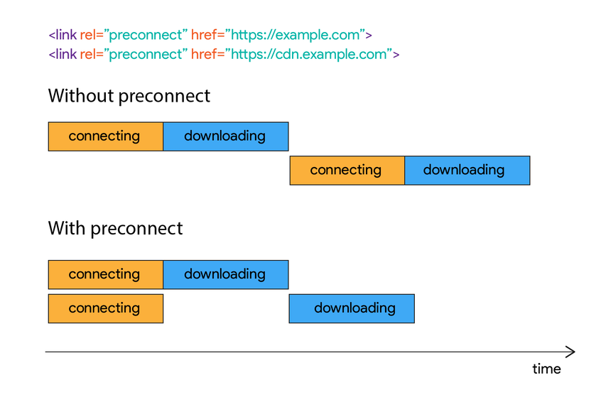
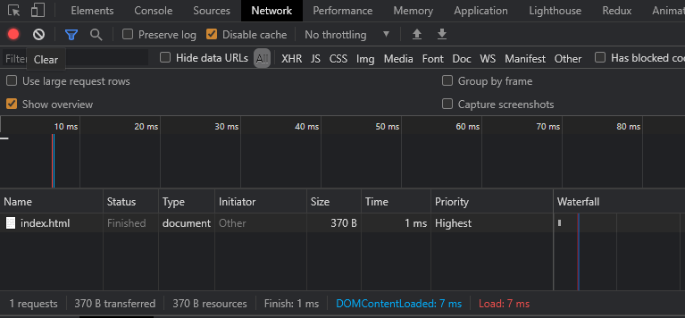
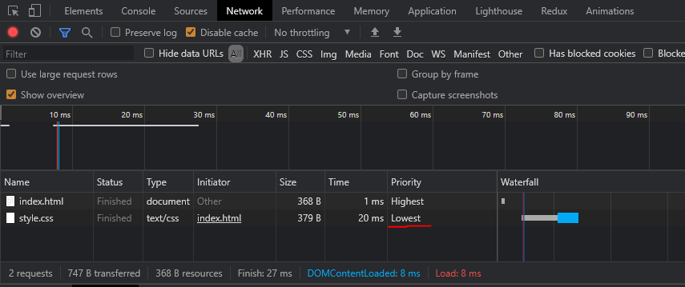

css파일과 같은 리소스를 로드해올 때 다음과 같이 많이 사용하는데,

```html
<link rel="stylesheet" href="style.css"
```

좀 더 나아가서 이러한 리소스의 우선순위를 지정할 수 있는 `link` 태그의 `preload`, `preconnect`, `prefetch`, `dns-prefetch`에 대해서 알아보겠습니다.

## preload

현재 페이지에서 사용될 것이 확실한 리소스들을 최우선 순위로 가지고 와야할 때 `preload`를 사용해야합니다.

```html
<link rel="preload" as="script" href="super-important.js" />
<link rel="preload" as="style" href="critical.css" />
```

`preload`는 위의 코드와 같이 `<link rel="preload" as="...">`와 같이 사용합니다.

### 주의사항

#### `as` 속성 사용

`as` 속성을 사용하여 리소스의 유형을 브라우저에게 알려줘야합니다. 올바른 유형이 설정되어 있지 않다면 브라우저는 해당 리소스를 요청하지 않습니다.

#### 중복 리소스 참조

`preload`는 브라우저가 반드시 리소스를 가져오게 만듭니다. 리소스를 중복 참조하면 중복된 개수만큼 리소스를 가져오기 때문에 리소스를 중복해서 참조하지 않도록 해야 합니다.

#### 반드시 사용되는 리소스에만 사용

`preload`는 현재 페이지에서 반드시 사용되는 리소스에만 사용되어야 합니다.


`preload`를 사용했지만 현재 페이지에서 3초 내로 사용되지 않다면 위와 같은 warning이 출력되게 됩니다.

### 사용 사례

이번에는 `preload`를 사용하기 좋은 리소스를 살펴보도록 하겠습니다.

#### 폰트

사용자가 사이트의 폰트를 기다리는 시간을 감소시키고, 시스템 폰트와 선언된 폰트의 충돌을 해결할 수 있습니다.

```html
<link rel="preload" as "font" crossorigin="crossorigin" type="font/woff2" href="myfont.woff2">
```

#### Critical Rendering Path의 CSS와 JavaScript

페이지 초기 렌더링 시 반드시 로드되어야할 리소스들을 `preload`로 우선적으로 로드해야합니다.

### Chrome DevTools

Chrome DevTools의 network panel에서 priority가 Highest로 찍힌걸 확인할 수 있습니다.


## preconnect & dns-prefetch

### preconnect

browser가 server로 부터 resource를 요청하기 전에 connection이 필요합니다. 이 connection을 하기 위해서는 다음의 3 step이 있습니다.

- Look up the domain name and resolve it to an IP address (dns-lookup)
- Set up a connection to the server
- Encrypt the connection for security

각 step에서 브라우저는 data 조각을 서버로 보내고 응답을 받습니다. 이러한 origin으로 부터 server로 갔다가 되돌아 오는 것을 round-trip 이라고 부릅니다.

network 상황에 따라서 한 번의 round-trip이 상당한 시간이 소요될 수 있고, 세번의 round-trip을 포함한 connection setup 과정이 네트워크 환경이 최적화 되지 않은 경우에 세번 이상이이 될 수도 있습니다. 이러한 과정을 리소스가 필요한 시점에 하는것이 아니라 미리 해놓는다면, 리소스가 필요한 시점에 더 빨리 로드할 수 있는데, `<link rel=preconnect>` 와 `<link rel=dns-prefetch>`를 통해서 할 수 있습니다.

`preconnect`와 `dns-prefetch`는 실제로 리소스를 다운하는게 아니라 리소스 다운을 위한 network connection을 미리 해두는 것 입니다.



이러한 방법으로 connection setup을 하는 100ms~500ms정도의 시간을 단축할 수 있습니다.

### dns-prefetch

`preconnect`를 사용하여 미리 connection setup을 하는 과정은 critical connections들에 사용을 하고 대부분의 경우에는 `<link rel=dns-prefetch>`를 사용하는 것이 좋습니다. `dns-prefetch`를 통하여 첫 번째 단계인 DNS-loopup만 수행해 20~120ms 정도의 시간을 줄일 수 있습니다.
또한 `preconnect`를 지원하지 않는 브라우저가 많기에 이에 대한 fallback으로 `dns-prefetch`를 사용할 수도 있습니다.

```html
<link rel="preconnect" href="http://example.com" />
<link rel="dns-prefetch" href="http://example.com" />
```

### 주의사항

preconnect는 외부 도메인과 연결을 구축하기 때문에 많은 CPU 시간을 차지할 수 있습니다. 보안 연결의 경우 더 많은 시간을 차지할 수 있습니다. 10초 이내로 브라우저가 닫힌다면, 이전의 모든 연결 작업은 낭비되는 것이기 때문에 브라우저가 빨리 닫힐 수 있는 페이지에서는 preconnect를 사용하지 않는 것이 좋습니다.

##### crossorigin

```html
<link rel="preconnect" href="https://example.com/ComicSans" crossorigin />
```

fonts와 같은 일부 리소스들의 경우 `preconnect`와 함께 `crossorigin` 속성을 추가해야합니다.
`crossorigin`속성을 가하지 않는다면 브라우저는 DNS-loopup만 수행하게 됩니다.

### 사용 사례

#### 정확한 경로를 알 수 없을 때

주어진 CDN으로 부터 리소스를 가져와야 한다는 것은 알지만 정확한 경로를 모르는 상황이 발생할 수 있습니다. 예를 들면 브라우저 별로 가져와야 하는 JQuery 등의 리소스 버전이 다를 때 가져와야 할 CDN 주소는 알지만 정확한 경로는 알지 못하는 상황을 이야기할 수 있습니다.

이러한 경우 브라우저는 리소스를 가져오지는 않지만 서버에 미리 연결하여 연결에 필요한 시간을 절약할 수 있습니다. 브라우저는 파일이 필요하기 전에는 리소스를 가져오지 않지만 적어도 연결은 먼저 처리해서 리소스를 요청하고 가져오는 여러 번의 왕복을 기다리지 않아도 됩니다.

#### 미디어 스트리밍

스크립트가 로드되고 스트리밍 데이터를 처리할 준비가 될 때까지 스트리밍을 기다리고 싶을 수 있습니다. preconnect는 미리 연결을 하기 때문에 리소스를 가져올 준비가 되면 연결을 설정하는 것이 아니라 미리 연결된 설정에 따라 리소스를 가져와 연결을 설정하는 대기 시간을 줄 일 수 있습니다.

### Chrome DevTools

다음과 같이 실제로 리소스를 다운받지는 않는 걸 알 수 있다.

```html
<link rel="preconnect" as="style" href="./style.css" />
```



## prefetch

미래에 사용될 것이라고 예상되는 리소스들을 `prefetch`합니다. 브라우저는 미래에 사용될 리소스들을 가져와 캐시에 저장합니다.
`prefetch`는 사용자가 다음에 할 행동을 미리 준비하는데 적합한 기능입니다. 예를 들어, 결과 목록에서 첫 번째 상세 페이지를 가져오거나 다음 페이지를 가져오는 것을 이야기할 수 있습니다.

```html
<link rel="prefetch" href="page-2.html" />
```

### 주의사항

#### 재귀적으로 동작하지 않는다.

```html
<link rel="prefetch" href="page-2.html" />
```

위의 코드와 같이 `prefetch`를 사용한다면, `page-2.html`이라는 HTML 리소스를 가져올 수 있지만 `page-2.html`에서 사용되는 CSS등의 리소스들은 가져오지 않습니다.

### Chrome DevTools

다음과 같이 priority가 Lowest인 것을 확인할 수 있습니다.



## 요약

현재 페이지에서 반드시 필요한 리소스(Render-block resource or fonts)는 `preload` 합니다.
`preconnect`와 `dns-prefetch`는 다른 도메인에서 리소스를 다운로드할 예정이지만 리소스의 정확한 URL을 모르는 경우 페이지 속도를 개선하는데 유용합니다. 예로 JavaScript 라이브러리, 이미지 또는 글꼴을 포하는 CDN이 있습니다. 그리고 중요한 리소스에 대해서만 `preconnect`를 이용하고 나머지는 `dns-prefetch`를 사용하는 것이 좋습니다.
현재 사용하지 않지만 미래에 사용되는 리소스는 `prefetch`를 하는게 좋습니다.

## Reference

- [리소스 우선순위::Beomy](https://beomy.github.io/tech/browser/preload-preconnect-prefetch/)
- [preconnect-and-dns-prefetch::web.dev](https://web.dev/preconnect-and-dns-prefetch/)
- [uses-rel-preconnect::web.dev](https://web.dev/uses-rel-preconnect/)
