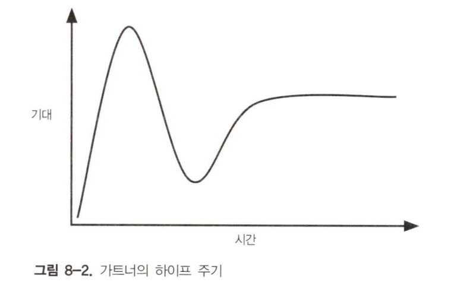

마지막 장은 "이 프로젝트에 어떤 프레임워크를 사용해야 할까요? 또는 프레임워크를 전혀 사용하지 않아도 될까요?"와 같은 질문에 대한 답을 구하는 데 도움이 될 것이다. 한마디로 '적합한 작업을 위한 적합한 도구'를 선택하는 방법을 이야기할 것이다. 이번 장에서는 기술 결정을 내릴 때 명심해야 할 원칙들을 정의하고 이러한 원칙을 기반으로 실용적인 도구에 어떤 것들이 있는지 알아본다.

## 자바스크립트 피로

자바스크립트 피로라는 표현은 2016년쯤 만들어졌으며 최신 라이브러리나 프레임워크를 따라 가지 못하는 좌절감을 나타낸다.

자바스크립트 생태계의 지속적인 변화에는 몇 가지 이유가 있다. 가장 중요한 것은 이제 자바스크립트가 거의 모든 곳에서 실행된다는 것이다. 가장 기본적인 브라우저 외에도 자바스크립트는 서버와 모바일 애플리케이션, 블록체인, 사물인터넷 같은 많은 다양한 환경에서 실행되고 있다.

개인적으로는 '자바스크립트 피로'라는 표현에 동의하지 않는다. 프레임워크와 라이브러리는 학습에 효과적이다. 따라서 프레임워크가 많아질수록 새로운 패러다임을 더 빨리 배울 수 있다. 지금은 '자바스크립트 르네상스'라고 부르고 싶다. 자바스크립트 개발자가 되기에 최적의 시기다.

## '적합한' 프레임워크

이 생태계가 개발자에게 큰 기회를 제공해줬지만 한편으로는 여전히 적합한 프레임워크를 선택해야 하는 도전 과제가 남아있다.

'선택'은 특정 프레임워크의 선택을 의미하는 것은 아니라 체계적인 분석과 의사결정 기법의 적용을 의미한다.

프로젝트에 맞는 '적합한' 프레임워크는 하나 이상 존재할 수 있다. 따라서 도전 과제를 '적합한 프레임워크의 선택'에서 '충분히 좋은 프레임워크의 선택'으로 변경하겠다.

## 안티패턴

### 노후화에 대한 두려움

자바스크립트 르네상스의 영향 중에는 많은 팀이 작업을 시작하자마자 스택이 이미 구식이 돼 버린 것이 아닌가 하는 두려움을 느끼게 됐다는 사실이 있다. 이 두려움 때문에 다음 프레임워크를 선택할 때는 오로지 인기에 편승하게 된다. 많은 사람이 사용할수록 좋다고 판단하는 것이다.
하지만 프레임워크의 수명과 인기는 아무런 관계가 없다.(ex. AngularJS)

진실은 여러분의 프로젝트가 성공하면 어떤 인기 있는 프레임워크보다도 생명력이 더 오래갈 것이라는 것이다. 언제부터 프로젝트의 '나이'를 걱정하기 시작하는 것이 좋을까? 나는 프로젝트의 라이프사이클에서 새로운 비즈니스 요구를 수용하지 못하게 될 때 소프트웨어가 '레거시'가 된다고 생각한다. 예를 들어 새로운 개발자가 필요하지만 소프트웨어의 오래된 스택 때문에 작업할 수 있는 개발자를 찾을 수 없을 때가 바로 그런 때다.

### 하이프 곡선 따르기

어떤 사람들은 자바스크립트 생태계의 끊임없는 변화에 대해 두려워하지만, 어떤 사람들은 반대로 이에 대해 흥분을 감추지 못한다. 일반적으로 이들은 새로운 '큰것'을 선택하는 경향이 있다. 문제는 이런 얼리어댑터들이 객척자라는 것이다. 즉 이들은 새로운 기술의 경계를 탐구하는 첫 번째 사람이 될 것이며, 이들이 직면한 문제를 해결하는 데 커뮤니티가 도움이 되지 않는다.

하이프 주기를 활용할 수도 있다. 가트너의 하이프 주기는 시장의 기술 채택을 시각적으로 보여준다.

### 일반적인 경로

일부 팀에서는 프레임워크나 도구에 대해 논의하지 않을 수도 있다. 이들은 모든 프로젝트에 동일한 기술을 사용한다. 10년 전에 제이쿼리로 프로젝트를 성공적으로 수행했다면 모든 프로젝트에 제이쿼리를 사용할 것이다. 이는 일반적으로 개발 팀과의 협의 없이 일방적으로 마감일을 정하는 잘못된 거버넌스 모델을 가진 회사에서 자주 일어난다. 이런 회사의 개발자들은 실패를 두려워하기 때문에 익숙한 도구만 사용하려고 한다. 이런 의사 결정 접근 방식은 콘웨이의 법칙의 결과 중 하나다.

> 시스템을 설계하는 조직은 이들 조직의 커뮤니케이션 구조의 복사본으로 설계를 하려는 경향이 있다.

따라서 회사가 잘못된 거버넌스 모델을 갖고 있다면 기술 결정이 모델의 영향을 받을 가능성이 크다.

### 전문가

회사의 거버넌스 모델에서 파생된 또 다른 안티패턴은 '전문가'에 의존하는 것이다. 일부 회사에서는 모든 기술 결정이 '소프트웨어 아키텍처'나 '전문가' 같은 높은 직책을 가진 일종의 전문가에 의해 이뤄진다.

이 사람이 중요한 결정을 내리는 데 필요한 모든 정보를 갖고 있지 않을 수 있기 때문에 매우 위험한 접근 방식이다. 프레임워크의 선택은 매우 중요한 결정이며, 따라서 가능하면 여러 사람과 협력적으로 진행돼야 한다.

### 분노 주도 결정

어떤 프레임워크를 사용해야 하는지는 몰라도 어떤 프레임워크를 피해야 하는지는 잘 알고 있는 팀도 있다. 이는 팀이 프로제그를 실패했을 떄 자주 일어난다. 그들은 부적절한 프레임워크의 선택을 비난한다. 그러나 실패한 이유를 조사해보면 많은 경우 실패는 프레임워크를 사용하는 잘못된 거버넌스 모델 때문이었음을 알게 됐다.

## 프레임워크 없는 운동 선언문

### 첫 번째 원칙

> 소프트웨어의 가치는 코드 자체가 아니고 왜 코드가 존재하는지에 대한 이유다.

다시 말해 소프트웨어에 대한 신중한 결정(프레임워크 선택과 같은)을 내리려면 소프트웨어 개발의 이유를 명확히 해야 한다.

### 두 번째 원칙

> 모든 결정은 콘텍스트를 고려해 내려야 한다. 특정 콘텍스트에서 결정한 좋은 선택이 다른 콘텍스트에서는 나쁜 선택이 될 수도 있다.

이 원칙은 명확해 보인다. 하지만 문제는 소프트웨어 애플리케이션의 '콘텍스트'를 어떻게 정의할 것인가이다. 내가 찾은 효과적인 방법은 비기능적 요구 사항 리스트를 사용하는 것이다. 우리는 기능적 요구사항이 무엇인지, 소프트웨어가 무엇을 해야 하는지 정의하는 방법을 알고 있다. 일반적으로 사용자 스토리 형식으로 제공된다.

> 익명 사용자로 로그인해 프리미엄 영역에 접근하고 싶다.

:::caution

신중한 기술적 결정을 내릴 때 기능적 요구 사항만 고려해서는 안 된다. 반드시 비기능적 요소도 고려해야 한다.

:::

### 세 번째 원칙

> 프레임워크의 선택은 기술적인 것이며 비즈니스 요구를 고려해 기술 담당자가 결정해야 한다.

### 네 번째 원칙

> 프레임워크를 선택하게 한 의사 결정 기준을 팀의 모든 구성원에게 알려야 한다.

이 원칙은 기술적 결정을 내리는 '방법'과 직접적인 관련은 없지만 아주 중요하다. 팀의 구성원 모두가 특정 결정을 내리게 된 기준을 알아야 한다. 처음의 콘텍스트를 모르면서 결정의 결과를 판단하기란 불가능하기 때문에 매우 중요하다.
