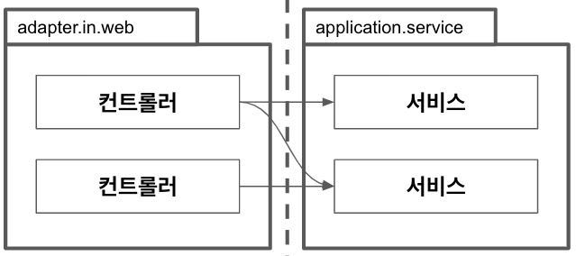

우리가 목표로 하는 아키텍처에서 외부 세계와의 모든 커뮤니케이션은 어댑터를 통해 이뤄진다. 웹 인터페이스를 제공하는 어댑터의 구현 방법을 살펴보자.

## 의존성 역전


:::note
인커밍 어댑터는 애플리케이션 서비스에 의해 구현된 인터페이스인 전용 포트를 통해 애플리케이션 계층과 통신한다.
:::

웹 어댑터는 '주도하는' 혹은 '인커밍' 어댑터다. 외부로부터 요청을 받아 애플리케이션 코어를 호출하고 무슨 일을 해야 할지 알려준다. 이때 제어 흐름은 웹 어댑터에 있는 컨트롤러에서 애플리케이션 계층에 있는 서비스로 흐른다.

애플리케이션 계층은 웹 어댑터가 통신할 수 있는 특정 포트를 제공한다. 서비스는 이 포트를 구현하고, 웹 어댑터는 이 포트를 호출할 수 있다.

다음과 같이 **의존성 역전 원칙**이 적용되어 제어 흐름이 왼쪽에서 오른쪽으로 흐르기 때문에 웹 어댑터가 유스케이스를 직접 호출할 수 있다.



:::note
포트 인터페이스를 삭제하고 서비스를 직접 호출할 수 있다.
:::

왜 어댑터와 유스케이스 사이에 또 다른 간접 계층을 넣어야 할까? 애플리케이션 코어가 외부 세계와 통신할 수 있는 곳에 대한 명세가 포트이기 때문이다. 포트를 적절한 곳에 위치시키면 외부와 어떤 통신이 일어나고 있는지 정확히 알 수 있다.

웹 소켓을 통해 실시간 데이터를 사용자의 브라우저로 보낸다고 가정해보자. 애플리케이션 코어에서는 이러한 실시간 데이터를 어떻게 웹 어댑터로 보내고, 웹 어댑터는 이 데이터를 어떻게 사용자의 브라우저로 전송하는 것일까?

이 시나리오에서는 반드시 포트가 필요하다. 포트는 웹 어댑터에서 구현하고 애플리케이션 코어에서 호출해야 한다.


:::note
만약 애플리케이션이 웹 어댑터에 능동적으로 알림을 줘야 한다면 의존성을 올바른 방향으로 유지하기 위해 아웃고잉 포트를 통과해야 한다.
:::

엄밀히 말하자면 이 포트는 아웃고잉 포트이기 때문에 웹 어댑터는 인커밍 어댑터인 동시에 아웃고잉 어댑터가 된다. 한 어댑터가 동시에 두 가지 역할을 하지 못할 이유는 없다.

## 어댑터의 책임

웹 어댑터는 일반적으로 다음과 같은 일을 한다.

1. HTTP 요청을 자바 객체로 매핑
2. 권한 검사
3. 입력 유효성 검증
4. 입력을 유스케이스의 입력 모델로 매핑
5. 유스케이스 호출
6. 유스케이스의 출력을 HTTP로 매핑
7. HTTP 응답을 반환

웹 어댑터는 URL, 경로, HTTP 메서드, 콘텐츠 타입과 같이 특정 기준을 만족하는 HTTP 요청을 수신해야 한다. 그리고 HTTP 요청의 파라미터와 콘텐츠를 객체로 역직렬화해야 한다.

웹 어댑터가 인증과 권한 부여를 수행하고 실패할 경우 에러를 반환한다.

그러고 들어오는 객체의 상태 유효성 검증을 할 수 있다. 입력 유효성 검증이 유스케이스 입력 모델의 책임이라고 이야기 했다. 유스케이스 입력 모델은 유스케이스의 맥락에서 유효한 입력만 허용해야 한다. 그러나 여기서는 **웹 어댑터**의 입력 모델에 대해 이야기하고 있는 것이다. **유스케이스**의 입력 모델과는 구조나 의미가 완전히 다를 수 있으므로 또 다른 유효성 검증을 수행해야 한다.

**웹 어댑터의 입력 모델을 유스케이스의 입력 모델로 변환할 수 있다**는 것을 검증해야 한다. 이 변환을 방해하는 모든 것이 유효성 검증 에러다.

다음으로 변환된 입력 모델로 특정한 유스케이스를 호출한다. 어댑터는 유스케이스의 출력을 반환받고, HTTP 응답으로 직렬화해서 호출자에게 전달한다.

이 과정에서 한 군데서라도 문제가 생기면 예외를 던지고, 웹 어댑터는 에러를 호출자에게 보여줄 메시지로 변환해야 한다.

웹 어댑터의 책임이 많기는 하지만 이 책임들은 어플리케이션 계층이 신경 쓰면 안 되는 것들이다. HTTP와 관련된 것은 애플리케이션 계층으로 침투해서는 안된다. 바깥 계층에서 HTTP를 다루고 있다는 것을 애플리케이션 코어가 알게 되면 HTTP를 사용하지 않는 또 다른 인커밍 어댑터의 요청에 대해 동일한 도메인 로직을 수행할 수 있는 선택지를 잃게 된다. 좋은 아키텍처에서는 선택의 여지를 남겨둔다.

웹 어댑터와 애플리케이션 계층 간의 이 경계는 웹 계층에서부터 개발을 시작하는 대신 도메인과 애플리케이션 계층부터 개발하기 시작하면 자연스럽게 생긴다. 인커밍 어댑터를 생각하지않고 유스케이스를 먼저 구현하면 경계를 흐리게 만들 유혹에 빠지지 않을 수 있다.

## 컨트롤러 나누기

웹 어댑터는 한 개 이상의 클래스로 구성해도 된다.

하지만 클래스들이 같은 소속이라는 것을 표현하기 위해 같은 패키지 수준(hierarchy)에 놓아야 한다.

컨트롤러는 너무 적은 것보다는 너무 많은 게 낫다. 각 컨트롤러가 가능한 한 좁고 다른 컨트롤러와 가능한 한 적게 공유하는 웹 어댑터 조각을 구현해야 한다.

```java title="AccountController를 하나 만들어 계좌와 관련된 모든 요청을 받는다."
package buckpal.adapter.web;

@RestController
@RequiredArgsConstructor
class AccountController {
  private final GetAccountBalanceQuery getAccountBalanceQuery;
  private final ListAccountsQuery listAccountsQuery;
  private final LoadAccountQuery loadAccountQuery;

  private final SendMoneyUseCase sendMoneyUseCase;
  private final CreateAccountUseCase createAccountUseCase;

  @GetMapping('/accounts')
  List<AccountResource> listAccounts() {
    ...
  }

  @GetMapping('/accounts/id')
  AccountResource getAccount(@PathVariable('accountId') Long accountId) {
    ...
  }

  @GetMapping('/accounts/{id}/balance')
  long getAccountBalance(@PathVariable('accountId') Long accountId) {
    ...
  }

  @PostMapping('/accounts')
  AccountResource createAccount(@RequestBody AccountResource account) {
    ...
  }

  @PostMapping('/accounts/send/{sourceAccountId}/targetAccountId}/{amount}')
  void sendMoney(
    @PathVariable('sourceAccountId') Long sourceAccountId,
    @PathVariable('targetAccountId') Long targetAccountId,
    @PathVariable('amount') Long amount) {
      ...
    }
  )
}
```

계좌 리소스와 관련된 모든 것이 하나의 클래스에 모여 있어 괜찮아 보인다. 단점을 살펴보자.

먼저, 클래스마다 코드는 적을수도 있다. 코드가 늘어나면 아무리 메서드로 깔끔하게 분리돼 있어서 읽기 쉽지않다.

테스트 코드도 마찬가지다. 컨트롤러에 코드가 많으면 그에 해당하는 테스트 코드도 많을 것이다. 보통 테스트 코드는 더 추상적이라서 프로덕션 코드에 비해 파악하기가 어려울 때가 많다. 따라서 특정 프로덕션 코드에 해당하는 테스트 코드를 찾기 어렵다.

모든 연산을 단일 컨트롤러에 넣는 것이 데이터 구조의 재활용을 촉진한다. 앞의 예제 코드에서 많은 연산들이 AccountResource 모델 클래스를 공유한다. AccountResource가 모든 연산에 필요한 모든 데이터를 담고 있는 큰 통인 것이다. 데이터를 반환하거나 처리할 때 관련없는 데이터들을 포함시킬지에 대해 고민을 할 수 있다.

각 연산에 대해 가급적이면 별도의 패키지 안에 별도의 컨트롤러를 만드는 방식을 선호한다. 가급적 메서드와 클래스명은 유스케이스를 최대한 반영해서 지어야 한다.

```java
package buckpal.adapter.web;

@RestController
@RequiredArgsConstructor
public class SendMoneyController {
  private final SendMoneyUseCasae;

  @PostMapping('/accounts/send/{sourceAccountId}/{targetAccountId}/{amount}')
  void sendMoney(
    @PathVariable('sourceAccountId') Long sourceAccountId,
    @PathVariable('targetAccountId') Long targetAccountId,
    @PathVariable('amount') Long amount
  ) {
    SendMoneyCommand command = new SendMoneyCommand(
      new AccountId(sourceAccountId),
      new AccountId(targetAccountId),
      Money.of(amount)
    );
    sendMoneyUseCase.sendMoney(command);
  }
}
```

각 컨트롤러가 CreateAccountResource나 UpdateAccountResource 같은 컨트롤러 자체의 모델을 가지고 있거나, 앞의 예제 코드처럼 원시값을 받아도 된다.

이러한 전용 모델 클래스들은 컨트롤러의 패키지에 대해 private 로 선언할 수 있기에 실수로 다른 곳에서 재사용될 일이 없다. 컨트롤러끼리 모델을 공유할 수 있지만 다른 패키지에 있어 공유해서 사용하기 전에 다시 생각해볼 수 있고 다시 생각해봤을 때, 필드의 절반은 필요없다는 걸 깨달아서 컨트롤러에 맞는 모델을 새로 만들게 될 확률이 높다.

이렇게 나누는 스타일의 또 다른 장점은 서로 다른 연산에 대한 동시 작업이 쉬워진다는 것이다.

## 유지보수 가능한 소프트웨어를 만드는 데 어떻게 도움이 될까?

애플리케이션의 웹 어댑터를 구현할 때는 HTTP 관련 로직만 처리할 뿐 어떤 도메인 로직도 수행하지 않는 어댑터를 만들고 있다는 점을 염두에 둬야 한다.

반면 애플리케이션 계층은 HTTP에 대한 상세 정보를 노출시키지 않도록 HTTP와 관련된 작업을 해서는 안된다. 이렇게 하면 필요할 경우 웹 어댑터를 다른 어댑터로 쉽게 교체할 수 있다.

웹 컨트롤러를 나눌 때는 모델을 공유하지 않는 여러 작은 클래스들을 만드는 것을 두려워해서는 안된다. 작은 클래스들은 더 파악하기 쉽고, 더 테스트하기 쉬우며, 동시 작업을 지원한다. 세분화된 컨트롤러를 만들면 유지보수하기 쉽다.
