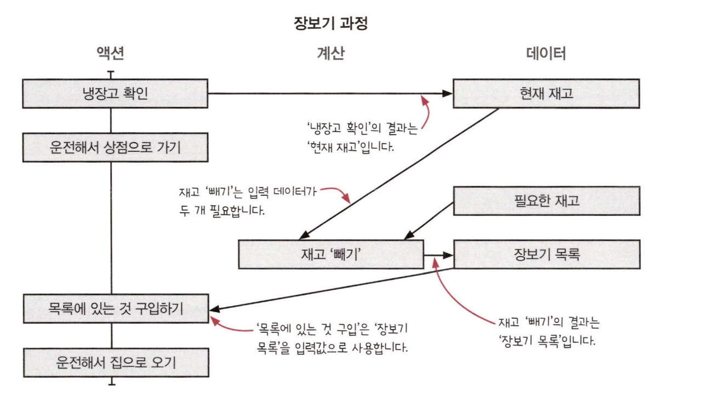
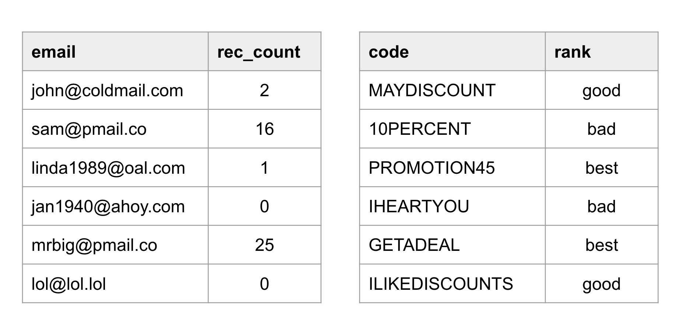

:::info 이번 장에서 살펴볼 내용

- 액션과 계산, 데이터가 어떻게 다른지 배웁니다.
- 문제에 대해 생각하거나 코드를 작성할 때 또는 코드를 읽을 때 액션과 계산, 데이터를 구분해서 적용해봅니다.
- 액션이 코드 전체로 퍼질 수 있다는 것을 이해합니다.
- 이미 있는 코드에서 어떤 부분이 액션인지 찾아봅니다.

:::

이 장에서는 현실 세계의 문제를 통해 코드에서 액션과 계산, 데이터를 찾아 적용하는 방법을 알아보겠습니다. 액션과 계산, 데이터를 구분하는 것은 함수형 프로그래밍의 첫 번째 단계입니다. 이 장을 통해 일반적으로 코드에 액션이 너무 많이 사용되고 있는 반면에 계산은 거의 찾아보기 힘든 이유를 알 수 있습니다.

## 액션과 계산, 데이터

| **액션** | **계산** | **데이터** |
| --- | --- | --- |
| 실행 시점과 횟수에 의존합니다. | 입력으로 출력을 계산합니다. | 이벤트에 대한 사실 |
| 다른 말로 **부수 효과**, **부수 효과가 있는 함수**, **순수하지 않은 함수**라고 부르기도 합니다. | 다른 말로 **순수 함수**, **수학 함수**라고 부르기도 합니다. | |
| 예) 이메일 보내기, 데이터베이스 읽기 | 예) 최댓값 찾기, 이메일 주소가 올바른지 확인하기 | 예) 사용자가 입력한 이메일 주소, 은행 API로 읽은 달러 수량 |

모든 개발 과정에서 액션과 계산 데이터를 구분하는 기술을 적용할 수 있습니다.

:::note 용어 설명

계산은 계산을 호출하는 코드를 계산 결과로 바꿀 수 있기 때문에 **참조 투명**합니다. 2 + 3의 예를 들어 봅시다. +는 계산이기 때문에 2 + 3의 결과는 항상 5 입니다. 그래서 2 + 3이라는 코드를 5라는 결괏값으로 바꿔도 프로그램이 달라지지 않습니다.

:::

### 1. 문제에 대해 생각할 때

문제를 액션과 계산, 데이터를 나눠보면 코드를 작성할 때 특별히 주의해야 할 부분(액션)과 데이터로 처리해야 할 부분, 결정을 내려야 하는 부분(계산)을 명확히 알 수 있습니다.

### 2. 코딩할 때

함수형 프로그래머는 최대한 액션에서 계산을 빼내려고 합니다. 또 계산에서는 데이터를 분리할 수 있는지 생각합니다. 더 나아가 액션이 계산이 될 수 있는지, 계산을 데이터가 될 수 있는지 고민합니다.

### 3. 코드를 읽을 때

코드를 읽을 때 액션과 계산, 데이터 중 어떤 것에 속하는지 잘 살펴봐야 합니다. 특히 액션은 시간에 의존하기 때문에 더 조심해야 합니다. 그래서 언제나 숨어있는 액션까지도 찾아야 합니다. 대부분의 함수형 프로그래머는 더 좋은 코드를 만들기 위해 이미 있는 코드를 액션과 계산, 데이터로 리팩터링하는 방법을 찾을 것입니다.

## 액션과 계산, 데이터는 어디에나 적용할 수 있습니다.

우리가 일상에서 자주 하는 장보기에 액션과 계산, 데이터를 적용해 봅시다. 

| | 장보기 과정 | 설명 |
| -- | -- | -- |
| 액션 | 냉장고 확인하기 | 액션입니다. 냉장고를 확인하는 시점에 따라 냉장고에 있는 제품이 다르기 때문입니다. |
| 액션 | 운전해서 상점으로 가기 | 이 단계 역시 액션입니다. 두 번 운전해서 상점에 가면 연료가 두 배로 듭니다. | 
| 액션 | 누군가가 브로콜리를 구입하면 브로콜리가 다 떨어질 수도 있기 때문에 구입하는 시점이 중요합니다. |
| 액션 | 운전해서 집으로 오기 | 이미 집에 있다면 상점에 있는 것이 아니기 때문에 상점에서 집으로 올 수 없습니다. 언제 하는지가 중요한 단계입니다. |

모든 것이 액션이라니! 뭔가 놓친 것이 있는 것 같습니다. 놓친 것이 있는지 단계별로 다시 살펴봅시다.

### 냉장고 확인하기

냉장고를 확인하는 일은 확인하는 시점이 중요하기 때문에 **액션**입니다. 사실 여기에는 **데이터**가 숨어 있습니다. 상점 위치나 가는 경로는 데이터로 볼 수 있습니다.

### 필요한 것 구입하기

구입하는 일도 확실히 **액션**입니다. 필요한 것을 구입하려면 필요한 것이 무엇인지 알아야 합니다. 필요한 것은 어떻게 알 수 있을까요? 필요하지만 없는 제품의 목록을 만드는 것이 가장 쉽습니다.

> 필요한 재고 - 현재 재고 = 장보기 목록

앞에 '냉장고 확인하기' 단계에서 만든 **현재 재고 데이터**를 사용했습니다. 이제 '필요한 것 구입하기' 단계를 몇 단계로 더 나눌 수 있습니다.

| | 구입하는 과정 | 설명 |
| -- | -- | -- |
| 데이터 | 현재 재고 | |
| 데이터 | 필요한 재고 | |
| 계산 | 재고 '빼기' | 재고 '빼기'는 같은 입력값일 때 항상 같은 결괏값을 주기 때문에 계산입니다.<br/>어떤 것을 결정하는 일은 계산으로 표현할 수 있습니다. 장보기 목록을 결정하는 것은 계산입니다. 실제 구입하는 단계와 구입할 것을 결정하는 단계를 나누었습니다. |
| 데이터 | 장보기 목록 | |
| 액션 | 목록에 있는 것 구입하기 | |

### 운전해서 집으로 오기

액션과 계산, 데이터를 더 명확하게 하기 위해 액션과 계산, 데이터에 해당하는 단계를 각각 다른 열에 그려봅시다. 그리고 데이터는 액션과 계산의 입력과 출력으로 사용되기 때문에 선으로 연결해 봅시다.



예를 들어 '냉장고 확인하기' 단계는 '냉장실 확인하기' 단계와 '냉동실 확인하기' 단계로 나눠 액션으로 만들 수 있습니다. 각 액션은 각각의 데이터를 만들 수도 있고 연결할 수 있습니다. 

계속 나누다 보면 점점 더 복잡해진다고 생각할 수 있습니다. 하지만 액션에 숨어 있는 다른 액션이나 계산 또는 데이터를 발견하기 위해 나눌 수 있는 만큼 나누는 것이 좋습니다.

## 장보기 과정에서 배운 것

### 1. 액션과 계산, 데이터는 어디에나 적용할 수 있습니다.

### 2. 액션 안에는 계산과 데이터, 또 다른 액션이 숨어 있을지도 모릅니다.

단순해 보이는 액션도 또 다른 액션이나 계산, 데이터로 나눌 수 있습니다. 함수형 프로그래밍에서는 액션을 더 작은 액션과 계산, 데이터로 나누고 나누는 것을 언제 멈춰야 할지 아는 것이 중요합니다.

### 3. 계산은 더 작은 계산과 데이터로 나누고 연결할 수 있습니다.

계산을 더 작은 계산으로 나누는 것이 더 좋을 떄도 잇습니다. 계산을 나누면 첫 번째 계산의 결과 데이터가 두 번째 계산의 입력이 됩니다.

### 4. 데이터는 데이터만 조합할 수 있습니다.

데이터는 다른 영향을 주지 않는 그냥 데이터입니다. 그래서 데이터 찾는 일을 먼저 해야 합니다. 데이터를 찾았다면 동작에 대해 많은 것을 알 수 있습니다.

### 5. 계산은 때로 '우리 머릿속에서' 일어납니다.

사실 계산 단계가 있지만 잘 보이지 않는 이유는 계산이 우리 사고 과정이 녹아있기 때문입니다. 이처럼 계산은 머릿속에서 나도 모르게 일어납니다.

하지만 이 사실을 알면 계산을 더 쉽게 찾을 수 있습니다. 어떤 단계에서 무엇인가 결정해야 할 것이 있는지 또는 무엇인가 계획해서 방법을 찾아야 할 것이 있는지 스스로에게 물어보면 됩니다. 결정과 계획은 계산이 될 가능성이 높기 때문입니다.

:::important 데이터에 대해 자세히 알아보기

#### 데이터는 무엇인가요?

데이터는 이벤트에 대한 사실입니다. 일어난 일의 결과를 기록한 것입니다.

#### 어떻게 데이터에 의미를 담을 수 있나요?

데이터 구조로 의미를 담을 수 있습니다. 예를 들어 목록의 순서가 중요하다면 순서를 보장하는 데이터 구조를 사용하면 됩니다. 데이터 구조로 도메인을 표현할 수 있습니다.

**불변성**

함수형 프로그래머는 불변 데이터 구조를 만들기 위해 두 가지 원칙을 사용합니다.

1. **카피-온-라이트**. 변경할 때 복사본을 만듭니다.
2. **방어적 복사**. 보관하려고 하는 데이터의 복사본을 만듭니다.

#### 데이터의 장점은 무엇인가요?

역설적으로 데이터는 데이터 자체로 할 수 있는 것이 없기 때문에 좋습니다. 그래서 데이터는 데이터 그대로 이해할 수 있습니다.

1. **직렬화** 직력화된 액션과 계산은 다른 곳에서 잘 동작할 것이라는 보장이 없습니다. 하지만 직렬화된 데이터는 전송하거나 디스크에 저장했다가 읽기 쉽습니다.
2. **동일성 비교** 계산이나 액션은 서로 비교하기 어렵습니다. 하지만 데이터는 비교하기 쉽습니다.
3. **자유로운 해석** 데이터는 여러 가지 방법으로 해석할 수 있습니다. 접속 로그는 문제 해결을 위해 사용할 수 있지만, 모니터링을 위해 사용할 수도 있습니다.

#### 데이터의 단점은 무엇인가요?

유연하게 해석할 수 있다는 점은 장점이지만, 해석이 반드시 필요하다는 점은 단점입니다.

:::

## 새로 만드는 코드에 함수형 사고 적용하기

### 쿠폰독의 새로운 마케팅 전략

쿠폰독은 쿠폰에 관심 있는 구독자들에게 이메일로 쿠폰을 매주 보내주는 서비스입니다.

쿠폰독 CMO는 사용자를 더 늘리기 위해 친구 10명을 추천하면 더 좋은 쿠폰을 보내주려고 합니다.

쿠폰독은 이메일별로 각 사용자가 추천한 친구 수를 기록하고 있습니다.

쿠폰에 대한 정보를 가지고 있는 데이터베이스도 있습니다. 쿠폰 데이터베이스는 각 쿠폰에 'bad', 'good', 'best'과 같은 등급 정보도 있습니다. 'best' 쿠폰은 추천을 많이 한 사용자를 위한 쿠폰입니다. 'good' 쿠폰은 모든 사용자들에게 전달되는 쿠폰이고 'bad' 쿠폰은 사용하지 않기 때문에 사용자에게 전달하지 않습니다.

## 쿠폰 보내는 과정을 그려보기

쿠폰 보내는 과정을 그리는 방법은 많지만 여기서는 특별한 형태로 그려보겠습니다. 이 방법으로 그리면 액션과 계산, 데이터를 구별해서 그릴 수 있습니다.



### 1. 데이터베이스에서 구독자를 가져오는 것부터 시작해 봅시다.

쿠폰을 이메일로 보내면서 먼저 데이터베이스에서 구독자를 가져와야 합니다. 이 단계는 **액션**입니다. 구독자는 계속 바뀌기 때문에 지금 가져온 구독자와 다음에 가져온 구독자는 다를 수 있습니다. 구독자를 데이터베이스에서 가져오면 사용자 목록을 얻을 수 있고, 이것은 **데이터**입니다.

### 2. 데이터베이스에서 쿠폰 목록 가져오기

데이터베이스에서 쿠폰 목록 가져오는 것도 **액션**입니다. 쿠폰 데이터베이스는 계속 바뀌기 때문에 가져오는 시점이 중요합니다. 그리고 가져온 쿠폰 목록은 **데이터**입니다.

### 3. 보내야 할 이메일 목록 만들기

함수형 프로그래머는 처리 과정에 필요한 데이터를 만들기도 합니다. 장을 볼 때 돌아다니면서 생각나는 것을 사지 않고 장보기 전에 목록을 만드는 것과 비슷하다고 할 수 있습니다.

'이메일 목록 계획하기'에서 생성된 이메일 목록은 다음 단계에서 사용할 데이터입니다.

### 4. 이메일 전송하기

이제 계획한 이베일을 보낼 수 있습니다. 이메일 메시지에는 수진자와 보낸 내용이 이미 앞에서 다 만들었기 때문에 목록을 순회하면서 그냥 보내면 됩니다.


### 이메일 만드는 부분을 자세히 살펴보기

계산을 나누면 구현하기 쉽습니다. 하지만 충분히 구현하기 쉽다고 생각되는 시점에서 더 나누는 것을 멈춰야 합니다.

## 쿠폰 보내는 과정 구현하기

쿠폰 등급을 결정하는 계산과 구독자 데이터, 쿠폰 등급 데이터가 있습니다.


### 데이터베이스에서 가져온 구독자 데이터

```ts
var subscriber = {
  email: "sam@pmail.com",
  rec_count: 16
}
```

### 쿠폰 등급은 문자열입니다.

```ts
var rank1 = "best";
var rank2 = "good";
```

### 쿠폰 등급을 결정하는 것은 함수입니다.

```ts
function subCouponRank(subscriber) {
  if (subscriber.rec_count >= 10) {
    return "best";
  } else {
    return "good";
  }
}
```

어떤 구독자가 어떤 등급의 쿠폰을 받을지 결정하는 것은 함수로 구현했습니다. 이 함수는 명확하고 테스트하기 쉬우며 재사용할 수 있습니다.

### 데이터베이스에서 가져온 쿠폰 데이터

구독자 데이터처럼 쿠폰 데이터도 객체로 표현할 수 있습니다.

```ts
var coupon = {
  code: "10PERCENT",
  rank: "bad"
}
```

### 특정 등급의 쿠폰 목록을 선택하는 계산은 함수입니다.

입력값은 전체 쿠폰 목록과 선택할 등급입니다. 출력값은 선택한 등급을 가진 쿠폰 목록입니다.

```ts
function selectCouponsByRank(coupons, rang) {
  var ret = [];
  for (var c = 0; c < coupons.length; c++) {
    var coupon = coupons[c];
    if (coupon.rank === rank) {
      ret.push(coupon.code);
    }
  }
  return ret;
}
```

selectCouponsByRank() 함수는 계산입니다.

### 이메일은 그냥 데이터입니다.

이메일을 데이터로 표현해봅시다.

```ts
var message = {
  from: "newsletter@coupondog.co",
  to: "sam@pmail.com",
  subject: "Your weekly coupons inside",
  body: "Here are your coupons ..."
}
```

### 구독자가 받을 이메일을 계획하는 계산

구독자에 대한 이메일을 만드는 함수이기 때문에 구독자를 인자로 받아야 합니다. 그리고 이메일에는 쿠폰 정보가 있어야 하기 때문에 쿠폰 목록도 입력값으로 받아야 합니다. 

```ts
function emailForSubscriber(subscriber, goods, bests) {
  var rank = subScriberRank(subscriber);
  if (rank === "best") {
    return {
      from: "newsletter@coupondog.co",
      to: subscriber.email,
      subject: "Your best weekly coupons inside",
      body: "Here are the best coupons: " + bests.join(", ");
    };
  } else {
    return {
      from: "newsletter@coupondog.co",
      to: subscriber.email,
      subject: "Your good weekly coupons inside",
      body: "Here are the good coupons: " + goods.join(", ");
    };
  }
}
```

### 보낼 이메일 목록을 준비하기

앞서 구독자가 받을 이메일을 생성하는 계산을 만들었습니다. 이제 필요한 것은 구독자 목록으로 전체 이메일 목록을 만드는 것입니다.

```ts
function emailsForSubscribers(subscribers, goods, bests) {
  var emails = [];
  for (var s = 0; s < subscribers.length; s++) {
    var subscriber = subscribers[s];
    emails.push(emailForSubscriber(subscriber, goods, bests));
  }
  return emails;
}
```

### 이메일 보내기는 액션입니다.

일반적으로 액션도 계산처럼 함수로 구현합니다. 그래서 함수만 보고 계산인지 액션인지 알아보기는 쉽지 않습니다.

```ts
function sendIssue() {
  var coupons = fetchCouponsFromDB();
  var goodCoupons = selectCouponsByRank(coupons, "good");
  var bestCoupons = selectCouponsByRank(coupons, "best");
  var subscribers = fetchSubscribersFromDB();
  var emails = emailsForSubscribers(subscribers, goodCoupons, bestCoupons);
  for (var e = 0; e < emails.length; e++) {
    var email = emails[e];
    emailSystem.send(email);
  }
}
```

모든 기능을 코드로 구현해 봤습니다. 이와 같이 데이터를 먼저 구현하고 계산을 구현한 후에 마지막으로 액션을 구현하는 것이 함수형 프로그래밍의 일반적인 구현 순서입니다.

:::important 계산에 대해 자세히 알아보기

#### 계산은 무엇인가요?

계산은 입력값으로 출력을 만드는 것입니다. 실행 시점과 횟수에 관계없이 항상 같은 입력값에 대해 같은 출력값을 돌려줍니다.

#### 어떻게 계산에 의미를 담을 수 있나요?

계산에는 연산을 담을 수 있습니다. 계산은 입력값을 출력값으로 만드는 것을 표현합니다. 계산을 언제 사용할지 또는 어떻게 사용할지는 때에 따라 다릅니다.

### 왜 액션보다 계산이 좋나요?

액션보다 좋은 점은 아래와 같습니다.

1. 테스트하기 쉽습니다.
2. 기계적인 분석이 쉽습니다. 정적 분석
3. 계산은 조합하기 좋습니다. 계산을 조합해 더 큰 계산을 만들 수 있습니다.

> 함수형 프로그래밍의 대부분은 계산을 가지고 하는 일입니다. 계산은 일반적으로 함수형 프로그래밍 외부에 있는 액션을 통해 수행됩니다.

### 꼐산을 쓰면서 걱정하지 않아도 되는 것

계산을 사용하면 아래를 걱정하지 않아도 됩니다.

1. 동시에 실행되는 것
2. 과거에 실행되었던 것이나 미래에 실행할 것
3. 실행 횟수

### 계산의 단점

계산과 액션은 실행하기 전에 어떤 일이 발생할지 알 수 없다는 단점이 있습니다.

소프트웨어 측면에서 함수는 블랙박스입니다. 입력값으로 실행해야 결과를 알 수 있ㅅ브니다.

### 계산은 일반적으로 무엇이라고 하나요?

다른 책에서 보통 **순수 함수** 또는 **수학 함수**라고 부릅니다.

:::

## 이미 있는 코드에 함수형 사고 적용하기

제나가 자회사에 수수료를 보내기 위해 만든 코드입니다. `sendPayout()` 함수는 실제 은행 계좌로 송금하는 액션입니다.

```js
function figurePayout(affiliate) {
  var owed = affiliate.sales * affiliate.commission;
  if (owed > 100) {// 100 달러 이하면 송금하지 않기
    sendPayout(affiliate.bank_code, owed);
  }
}

function affiliatePayout(affiliates) {
  for (var i = 0; i < affiliates.length; i++) {
    figurePayout(affiliates[i]);
  }
}

function main(affiliates) {
  affiliatePayout(affiliates);
}
```

제나가 만든 코드는 함수형 코드라고 하기 어렵습니다. 그리고 액션은 하나가 아닙니다.

`sendPayout()` 함수부터 시작해 점점 액션이 코드 전체로 퍼져나갑니다.

## 액션은 코드 전체로 퍼집니다.

제나가 만든 코드는 잘못된 코드가 아닙니다. 다만 함수형 사고를 적용하지 않은 코드입니다.

액션을 부르는 함수가 있다면 그 함수도 액션이 됩니다. 또 그 함수를 부르는 다른 함수도 역시 액션이 됩니다. 이런식으로 작은 액션 하나가 코드 전체로 퍼져 나갑니다.

## 액션은 다양한 형태로 나타납니다.

자바스크립트에서 발생할 수 있는 액션을 살펴봅시다. 액션은 어디서나 쉽게 볼 수 있습니다.

```js title="함수 호출"
alert("Hello world!"); // 팝업 창이 뜨는 것은 액션입니다.
```

```js title="메서드 호출"
console.log("hello"); // 콘솔에 출력합니다.
```

```js title="생성자"
new Date(); // 기본적으로 부르는 시점에 현재 날짜와 시간을 초기화하기 때문에 호출되는 시점에 따라 다른 값을 가집니다.
```

```js title="표현식"
// 변수 참조
y
// 속성 참조
user.first_name
// 배열 참조
stack[0]
```

```js title="상태"
// 값 할당
z = 3;
// 속성 삭제
delete user.first_name;
```

액션을 찾기 위해 액션 코드를 모두 찾을 필요는 없습니다. 단지 코드가 호출 시점이나 횟수에 의존하는지 생각해보면 됩니다.

:::important 액션에 대해 자세히 알아보기
### 액션은 무엇입니까?

액션은 외부 세계에 영향을 주거나 받는 것을 말합니다. 그리고 액션은 실행 시점과 횟수에 의존합니다.

- 언제 실행되는지 - **순서**
- 얼마나 실행되는지 - **반복**

### 어떻게 액션에 의미를 담을 수 있나요?

액션으로 외부 세강에 영향을 줄 수 있습니다.

### 액션은 일반적으로 무엇이라고 하나요?

다른 책에서 액션은 **순수하지 않은 함수**, **부수 효과 함수** 라고 부릅니다.

> 액션은 함수형 프로그래밍에서 가장 중요합니다. 앞으로 액션을 제한적으로 사용하는 법에 다루겠습니다.

### 액션은 쉽지 않습니다.

- 액션은 다루기 힘듭니다.
- 액션은 우리가 소프트웨어를 실행하려는 가장 중요한 이유입니다.

액션은 사용하기 어렵습니다. 하지만 꼭 써야 합니다. 다음은 액션을 잘 사용하는 방법입니다.

1. 가능한 액션을 적게 사용합니다. 액션을 전혀 쓰지 않을 수 없습니다. 액션 대신 계산을 사용할 수 있을지 생각해 봐야 합니다.
2. 액션은 가능한 작게 만듭니다.
3. 액션이 외부 세계와 상호작용하는 것을 제한할 수 있습니다. 내부에 계산과 데이터만 있고 가장 바깥쪽에 액션이 있는 구조가 이상적입니다.
4. 액션이 호출 시점에 의존하는 것을 제한합니다.
:::

## 요점 정리

- 함수형 프로그래머는 액션과 계산, 데이터를 구분합니다.
- 액션은 실행 시점이나 횟수에 의존합니다. 일반적으로 액션은 외부 세게에 영향을 주거나 받습니다.
- 계산은 입력값으로 출력값을 만드는 것입니다. 외부 세계에 영향을 주거나 받지 않고 실행 시점이나 횟수에 의존하지 않습니다.
- 데이터는 이벤트에 대한 사실입니다.
- 함수형 프로그래머는 액션보다 계산을 좋아하고 계산보다 데이터를 좋아합니다.
- 계산은 같은 입력값을 주면 항상 같은 출력값이 나오기 때문에 액션보다 테스트하기 쉽습니다.
