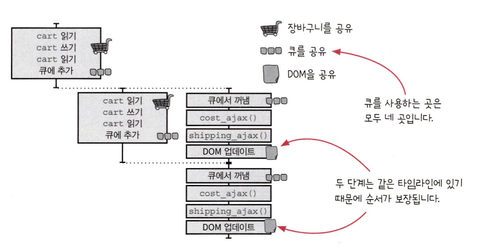

:::info 이번 장에서 살펴볼 내용

- 자원을 공유해서 생기는 버그를 찾는 방법을 배웁니다.
- 안전하게 자원을 공유할 수 있는 자원 공유 기본형을 만드는 방법을 이해합니다.

:::

타임라인끼리 공유 자원을 줄이는 방법에 대해 배웠습니다. 자원을 공유하지 않는 타임라인이 가장 좋습니다. 하지만 자원 공유가 필요한 경우가 있습니다. 자원을 공유해야 한다면 안전하게 공유해야 합니다. 이 장에서는 자원을 안전하게 공유하기 위해 **동시성 기본형**(concurrency primitive)이라는 재사용 가능한 코드를 만드는 방법을 알아보겠습니다.

## 장바구니에 아직 버그가 있습니다.

버그는 DOM 자원을 공유하기 때문에 생깁니다. 두 액션이 자원을 공유하지 않는다면 실행 순서를 신경 쓰지 않아도 됩니다. 가능한 모든 순서에서 같은 결과가 나오기 때문입니다. 하지만 자원을 공유한다면 실행 순서는 중요합니다.

첫 번째 DOM 업데이트가 나중에 실행되면 올바른 결과인 두 번째 결과를 덮어쓰게 됩니다.

## DOM이 업데이트되는 순서를 보장해야 합니다.

특정 순서로 DOM이 업데이트되어야 문제가 없습니다. 업데이트 순서를 제한해야 합니다. 클릭한 순서대로 DOM이 업데이트돼야 합니다.

큐는 뎌러 타임라인에 있는 액션 순서를 조율하기 위해 많이 사용합니다. 큐는 공유 자원이지만 안전하게 공유됩니다. 순서대로 작업을 꺼내 쓸 수 있기 때문입니다. 그리고 큐에 있는 모든 작업은 같은 타임라인에서 처리되기 때문에 순서가 관리됩니다.

## 자바스크립트에서 큐 만들기

### 자바스크립트에는 큐 자료 구조가 없기 때문에 만들어야 합니다.

큐는 자료 구조지만 타임라인 조율에 사용한다면 **동시성 기본형**이라고 부릅니다. 동시성 기본형은 자원을 안전하게 공유할 수 있는 재사용 가능한 코드를 말합니다.

1. 큐에서 처리할 작업을 큐에 넣기
2. 큐에 있는 첫 번째 항목을 실행합니다.
3. 두 번째 타임라인이 첫 번째 타임라인과 동시에 실행되는 것을 막기
4. 큐에 있는 다음 작업을 실행합니다.
5. 항목이 없을 때 멈추게 하기

```js
function Queue(worker) {
  var queue_items = [];
  var working = false;

  function runNext() {
    if (working) {
      return;
    }
    if (queue_items.length === 0) {
      return;
    }
    working = true;
    var item = queue_items.shift();
    worker(item.data, function (val) {
      working = false;
      setTimeout(item.callback, 0, val);
      runNext();
    });
  }

  return function (data, callback) {
    queue_items.push({
      data: data,
      callback: callback || function () {},
    });
    setTimeout(runNext, 0);
  };
}

function calc_cart_worker(cart, done) {
  calc_cart_total(cart, function(total) {
    update_total_dom(total);
    done(total);
  })
}

var update_total_queue = Queue(calc_cart_worker);
```

`Queue()`는 액션에 **순서 보장** 슈퍼 파워를 주는 도구로 볼 수 있습니다.

`Queue()`라는 말 대신 `linearize()`라고 할 수도 있습니다. 큐가 액션 호출을 순서대로 만들기 때문입니다.

`Queue()`는 **동시성 기본형**입니다. 여러 타임라인을 올바르게 동작하도록 만드는 재사용 가능한 코드입니다. 동시성 기본형은 방법은 다르지만 모두 실행 가능한 순서를 제한하면서 동작합니다. 



큐를 사용해 DOM 업데이트를 같은 타임라인에서 하도록 만들었기 때문에 순서 문제가 생기지 않습니다. 제품 추가 버튼을 누르는 순서대로 DOM 업데이트가 실행됩니다. 같은 타임라인에 있기 때문에 가능한 순서를 따져볼 필요가 없습니다. 하나의 타임라인에 있는 액션은 항상 순서대로 실행됩니다.

마지막 공유 자원은 큐입니다. 큐는 모든 타임라인에서 서로 다른 네 단계에서 사용하고 있습니다.

## 원칙: 문제가 있을 것 같으면 타임라인 다이어그램을 살펴보세요

타임라인 다이어그램의 가장 큰 장점은 타이밍 문제를 명확히 보여준다는 것입니다. 공유된 자원이 잘못된 순서로 사용되는지 알 수 있습니다.

타이밍에 관한 버그는 재현하기 매우 힘들기 때문에 타임라인 다이어그램이 필요합니다. 코드에서 명확하게 드러나지 않고 모든 테스트를 통과할지도 모릅니다. 테스트를 백 번 수행해도 실행 가능한 순서를 모두 재현하지 못할 수도 있습니다. 하지만 서비스에 배포해서 백만 명의 사용자가 코드를 실행한다면 결국 문제가 생길 것입니다.

만약 액션을 사용하는 프로그래밍을 하고 있다면 타임라인 다이어그램으로 그리는 것이 좋습니다. 타임라인 다이어그램은 모든 실행 가능한 순서를 포함해 소프트웨어가 어떻게 동작하는지 이해하는 데 쓸 수 있는 유연한 도구입니다.

## 요점 정리

- 타이밍 문제는 재현하기 어렵고, 테스트로 확인하지 못할 수도 있습니다. 타임라인 다이어그램을 그려 분석하고 타이밍 문제를 확인해 보세요.
- 자원 공유 문제가 있을 때 현실에서 해결 방법을 찾아보세요.
- 재사용 가능한 도구를 만들면 자원 공유에 도움이 됩니다. 자원 공유를 위한 도구를 동시성 기본형이라고 부릅니다. 동시성 기본형을 사용하면 코드가 더 깨끗하고 단순해집니다.
- 동시성 기본형은 액션을 고차함수로 받습니다. 이 고차함수는 액션에 슈퍼 파워를 줍니다.
- 동시성 기본형은 스스로 만들기 어렵지 않습니다. 작은 단계부터 시작해 리팩터링 하면서 스스로 만들 수 있습니다.
