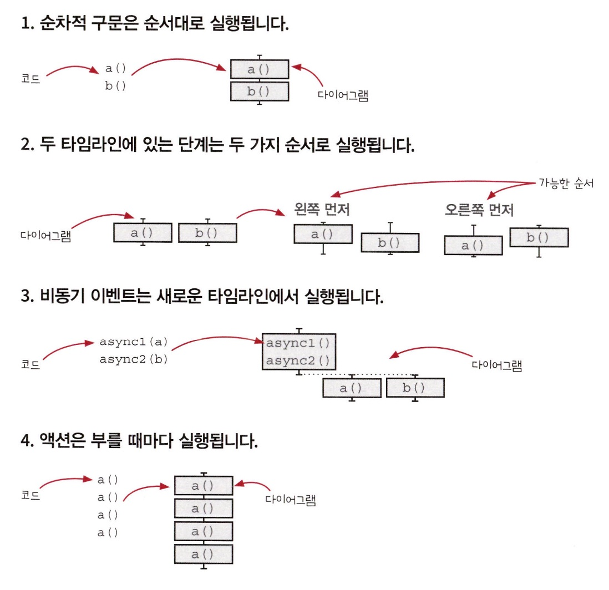

:::info 이번 장에서 살펴볼 내용

- 타임라인을 조율하기 위한 동시성 기본형을 만들어 봅니다.
- 시간에 관한 중요한 관점인 순서와 반복을 함수형 개발자들이 어떻게 다루는지 배웁니다.

:::

지난 장에서 자원 공유로 인한 버그를 찾고 **동시성 기본형**으로 안전하게 자원을 공유했습니다. 어떤 경우에는 눈에 보이는 공유 자원은 없지만, 타임라인이 함께 협력해야 하는 경우가 있습니다. 이 장에서는 타임라인을 조율하고 잘못된 실행 순서를 없애기 위한 동시성 기본형을 만들어 볼 것입니다.

## 좋은 타임라인의 원칙

### 1. 타임라인은 적을수록 이해하기 쉽습니다.

새로운 타임라인이 생기면 시스템은 이해하기 어려워집니다. 타임라인 수를 줄이면 시스템을 이해하기 더 쉽습니다.

### 2. 타임라인은 짧을수록 이해하기 쉽습니다.

타임라인 단계를 줄이면 실행 가능한 순서를 많이 줄일 수 있습니다.

### 3. 공유하는 자원이 적을수록 이해하기 쉽습니다.

두 타임라인을 볼 떄, 자원을 공유하는 단계만 생각하면 됩니다.

### 4. 자원을 공유한다면 서로 조율해야 합니다.

타임라인을 볼 때 자원을 공유하는 단계만 조심하면 됩니다. 자원을 공유하는 단계를 줄이면 가능한 순서를 줄일 수 있습니다.

### 5. 시간을 일급으로 다룹니다.

액션의 순서와 타이밍을 맞추는 것은 어렵습니다. 타임라인을 관리하는 재사용 가능한 객체를 만들면 타이밍 문제를 쉽게 처리할 수 있습니다. 중요한 것은 시간에 대한 관점입니다.

## 타임라인을 나누기 위한 동시성 기본형

여러 타임라인이 다른 시간에 종료되어도 서로 기다릴 수 있는 간단한 기본형이 필요합니다. 만약 그런 것이 있다면 여러 타임라인이 실행되는 순서를 신경 쓰지 않아도 되고 타임라인이 모두 끝나는 것도 쉽게 처리할 수 있습니다. 결국 경쟁 조건을 막을 수 있습니다.

멀티스레드를 지원하는 언어에서는 스레드가 변경 가능한 상태를 공유하기 위해 원자적 업데이트 같은 기능을 사용해야 합니다. 하지만 자바스크립트는 단일 스레드라는 장점을 활용할 수 있습니다. 가능한 동기적으로 접근하는 간단한 변수로 동시성 기본형을 구현할 수 있습니다. 어떤 함수를 만들겠습니다. 그리고 어떤 타임라인 작업이 끝났을 때 이 함수를 부를 것입니다. 이 함수는 호출될 떄마다 호출된 횟수를 증가시킵니다. 그리고 마지막 타임라인이 함수를 호출했을 때 콜백을 불러줍니다.

```ts
function Cut(num, callback) {
  var num_finished = 0;
  return function() {
    num_finished += 1;
    if (num_finished === num) {
      callback();
    }
  }
}
```

### 간단한 예제
```ts
var done = Cut(3, function() {
  console.log("3 timelines are finished");
});

done();
done();
done();
```

:::note 되새겨보기

자바스크립트 스레드는 하나입니다. 타임라인은 다른 타임라인이 시작되기 전에 완료됩니다. Cut()은 이런 장점을 활용해 변경할 수 있는 값을 안전하게 공유합니다. 다른 언어에서는 타임라인을 조율하기 위해 락이나 다른 기능을 사용해야 합니다.

:::

## 코드에 Cut() 적용하기

Cut() 동시성 기본형이 생겼습니다. 두 가지만 고민하면 됩니다.

1. Cut()을 보관할 범위
2. Cut()에 어떤 콜백을 넣을지

### 1. Cut()을 보관할 범위

응답 콜백 끝에서 done()을 불러야 합니다. 따라서 두 응답 콜백을 만드는 calc_cart_total() 함수 범위에 Cut()을 만드는 것이 좋을 것 같습니다.

### 2. Cut()에 어떤 콜백을 넣을지

```js title="원래 코드"
function calc_cart_total(cart, callback) {
  var total = 0;

  cost_ajax(cart, function(cost) {
    total += cost;
  });
  shipping_ajax(cart, function(shipping) {
    total += shipping;
    callback(total);
  });
}
```
```js title="Cut()을 적용한 코드"
function calc_cart_total(cart, callback) {
  var total = 0;

  var done = Cut(2, function() {
    callback(total);
  })

  cost_ajax(cart, function(cost) {
    total += cost;
    done();
  });
  shipping_ajax(cart, function(shipping) {
    total += shipping;
    done();
  });
}
```

## 딱 한 번만 호출하는 기본형

액션을 여러 번 호출해도 한 번만 실행되도록 만들 수 있는 기본형이 필요합니다.

다음은 어떤 함수를 새로운 함수로 감싸는 JustOnce() 함수입니다.

```ts
function JustOnce(action) {
  var alreadyCalled = false;
  return function(a, b, c) {
    if (alreadyCalled) return;
    alreadyCalled = true;
    return action(a, b, c);
  }
}
```

Cut() 처럼 JustOnce()도 타임라인 사이에 변수가 공유될 수 있습니다. 하지만 비동기 코드가 아니기 떄문에 자바스크립트에서는 안전합니다. 멀티스레드를 지원하는 언어에서는 스레드를 조율하기 위해 락이나 atomic 업데이트 같은 것을 사용해야 합니다. 이제 한 번만 실행하는 sendAddToCartText() 버전을 쉽게 만들 수 있습니다.

```js
var sendAddToCartTextOnce = JustOnce(sendAddToCartText);

sendAddToCartTextOnce("555-555-5555-55");
sendAddToCartTextOnce("555-555-5555-55");
sendAddToCartTextOnce("555-555-5555-55");
sendAddToCartTextOnce("555-555-5555-55");
```


## 암묵적 시간 모델 vs 명시적 시간 모델

모든 언어는 암묵적으로 시간에 대한 모델을 가지고 있습니다. 시간 모델로 실행에 관한 두 가지 관점을 알 수 있습니다. 바로 순서와 반복입니다.

자바스크립트의 시간 모델은 간단합니다.

1. 순차적 구문은 순서대로 실행됩니다.
2. 두 타임라인에 있는 단계는 왼쪽 먼저 실행되거나, 오른쪽 먼저 실행될 수 있습니다.
3. 비동기 이벤트는 새로운 타임라인에서 실행됩니다.
4. 액션은 호출할 떄마다 실행됩니다.



간단한 프로그램에서 암묵적 시간 모델은 좋습니다. 하지만 실행 방식을 바꾸지 못합니다. 사실 암묵적 시간 모델의 실행 방식이 애플리케이션에서 필요한 실행 방식과 맞을 일은 거의 없습니다. 그래서 함수형 개발자는 필요한 실행 방식에 가깝게 새로운 시간 모델을 만듭니다. 예를 들어 비동기 콜백을 사용할 때 새로운 타임라인을 만들지 않도록 큐를 만들었습니다. 또 여러 번 호출해도 한 번만 실행하는 액션을 만들기 위해 JustOnce() 기본형을 만들었습니다.

## 요약: 타임라인 사용하기

다음은 더 좋은 방법으로 여러 타임라인을 함께 사용하기 위한 방법입니다. 가장 중요한 것부터 순서대로 나열했습니다.

### 타임라인 수를 줄입니다.

스레드나 비동기 호출, 서버 요청을 줄여 적은 타임라인을 만들면 시스템이 단순해집니다.

### 타임라인 길이를 줄입니다.

타임라인에 있는 액션을 줄여보세요. 또 액션을 계산으로 바꿔보세요. 그리고 암묵적인 입력과 출력을 없애 보세요.

### 공유자원을 없앱니다.

공유하는 자원을 줄여보세요. 자원을 공유하지 않는 타임라인은 순서 문제가 생기지 않습니다. 가능하다면 단일 스레드에서 공유 자원에 접근하세요.

### 동시성 기본형으로 자원을 공유합니다.

자원을 안전하지 않게 공유한다면 큐나 락을 사용해 안전하게 공유할 수 있는 방법으로 바꾸세요.

### 동시성 기본형으로 조율합니다.

타임라인을 도율하기 위해 Promise나 컷과 같은 것으로 액션에 순서나 반복을 제한해 보세요.

## 결론

이 장에서 웹 요청의 시간 차이 떄문에 발생하는 경쟁 조건에 대해 알아봤습니다. 요청한 순서대로 응답이 도착하면 모든 것이 문제없습니다. 하지만 이것은 보장할 수 없습니다. 그래서 가끔 잘못된 결과를 얻게 됩니다. 두 타임라인이 협력할 수 있는 동시성 기본형을 만들었습니다. 그래서 항상 같은 결과를 얻을 수 있었습니다. 이런 방법으로 타임라인을 조율할 수 있었습니다.

## 요점 정리

- 함수형 개발자는 언어가 제공하는 암묵적 시간 모델 대신 새로운 시간 모델을 만들어 사용합니다. 새로운 모델은 해결하려고 하는 문제를 푸는 데 도움이 됩니다.
- 명시적 시간 모델은 종종 일급 값으로 만듭니다. 일급 값으로 만든 시간 모델은 프로그래밍 언어를 사용해서 시간을 다룰 수 있습니다.
- 타임라인을 조율하기 위해 동시성 기본형을 만들 수 있습니다. 가능한 순서를 제한해 항상 올바른 결과가 나올 수 있도록 보장합니다.
- 타임라인을 나누는 것도 타임라인을 조율하는 방법 중 하나입니다. 컷은 모든 타임라인의 작업이 끝날 떄까지 기다렸다가 새로운 타임라인을 시작할 수 있도록 합니다.
