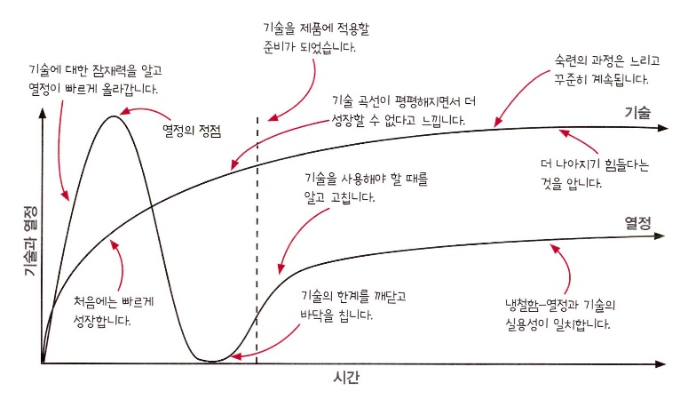

:::info 이번 장에서 살펴볼 내용

- 직장 상사의 심기를 건드리지 않고 새로운 기술을 적용하거나 학습하는 방법을 배웁니다.
- 함수형 기능에 심취하기 위해 함수형 프로그래밍 언어 한두 개를 골라 봅니다.
- 함수형 프로그래밍의 수학적인 관점으로 깊이 들어가 봅니다.
- 함수형 프로그래밍을 더 배우기 위한 책을 알아봅니다.

:::

## 마지막 장의 계획

### 이 책에서 배운 기술을 다시 보기

이 장까지 오는 과정을 돌아보기 위해 배운 기술을 다시 살펴보겠습니다.

### 마스터를 향해 가는 길

기술을 배웠습니다. 기술을 배우면서 우리는 비슷한 길을 걷게 됩니다. 마스터가 되기 위해 가는 길을 한 차원 높은 곳에서 살펴보겠습니다. 투 트랙 모델에 대해 배우게 됩니다.

### 트랙 1: 샌드박스

새로운 기술을 실험하고 연습해 보기 위한 장소가 필요합니다.

- 사이드 프로젝트
- 연습 문제로 훈련하기

### 트랙 2: 제품

기술이 숙력되었다면 기술을 더욱 갈고닦기 위해 실제 제품에 적용해 봐야 합니다. 원하는 대로 적용해 볼 수 있지만, 다음과 같은 곳에서 먼저 해보면 좋습니다.

- 오늘 당장 버그를 없애 보기
- 설계를 하나씩 개선해 보기

## 전문가의 기술을 배웠습니다.

전문적인 함수형 개발자들은 강력함과 깊이를 위해 이런 기술을 선택했습니다.

### 파트 1: 액션과 계산, 데이터

- 코드에서 액션과 계산, 데이터를 구분해 가장 문제가 되는 부분을 찾습니다.
- 액션에서 계산을 뺴내 재사용하기 좋고 테스트하기 쉬운 코드를 만듭니다.
- 암묵적인 입력과 출력을 명시적인 것으로 바꿔 액션의 설계를 개선합니다.
- 불변성을 구현해 데이터 읽기를 계산으로 만듭니다.
- 계층형 설계로 코드를 구성하고 개선합니다.

### 파트 2: 일급 추상

- 언어의 문법을 일급으로 만들어 코드를 추상화할 수 있습니다.
- 함수형 반복과 함수형 도구를 사용해 고차원으로 추론합니다.
- 함수형 도구를 연결해 데이터 변환 파이프라인을 만듭니다.
- 타임라인 다이어그램을 통해 동시성 분산 시스템을 이해합니다.
- 버그를 없애기 위해 타임라인을 활용합니다.
- 고차 함수로 안전하게 상태를 변경합니다.
- 반응형 아키텍처를 사용해 원인과 효과의 결합을 줄입니다.
- 세상과 상호작용하기 위해 어니언 아키텍처 설계를 서비스에 적용합니다.

## 꼭 기억해야 할 것

아래 3가지 내용은 가장 중요하기 때문에 꼭 기억하세요.

### 어떤 경우에는 액션에 계산이 숨어 있습니다.

계산을 찾아서 빼내는 것은 귀찮지만 가치있는 일입니다. 계산은 액션보다 재사용하기 좋고, 테스트하거나 이해하기 쉽습니다. 그리고 빼내는 데 그렇게 많은 시간이 걸리지 않을 것입니다. 액션과 계산, 데이터를 구분하는 것은 함수형 프로그래밍 기술의 기본입니다.

액션과 계산, 데이터는 변경되는 빈도에 따라 각각 다른 계층으로 구성할 수 있습니다. 넓은 관점에서 보면 아키텍처에 대한 문제이고 결국 어니언 아키텍처로 구성하게 됩니다.

### 고차 함수를 사용하면 추상화에 대한 개념이 넓어집니다.

고차 함수를 사용하면 똑같은 저수준의 코드를 반복적으로 만들지 않아도 됩니다. 고차 함수를 사용하면 반복되는 코드를 한 번만 작성하면 됩니다. 그리고 도메인에 집중할 수 있습니다.

### 코드에서 시간의 의미는 마음대로 바꿀 수 있습니다.

어떤 코드가 여러 타임라인에서 실행된다면 기대하지 않은 실행 순서 때문에 버그가 생길 수 있습니다. 요즘은 대부분의 소프트웨어가 여러 타임라인을 갖습니다. 따라서 코드가 실행되는 순서를 이해하는 것은 매우 중요합니다.

타임라인 다이어그램으로 시간 흐름에 따라 코드가 어떻게 실행되는지 시각화할 수 있습니다. 액션이 동시에 실행되는지 차례로 실행되는지 알 수 있습니다. 액션은 실행 시점과 실행 횟수가 중요하다는 것을 기억하세요. 함수형 개발자는 액션의 순서와 반복을 바꿀 수 있다고 생각합니다. 기본형을 만들어 문법적 실행 방법을 다른 순서나 반복으로 바꿀 수 있습니다.

## 시간에 따른 기술과 열정의 변화

새로운 기술을 배울 때마다 완전한 숙달을 위해 누구나 비슷한 과정을 거칩니다. 처음에는 새로운 기술을 알게 된 기쁨을 주체하지 못하고 여기저기 적용할 곳을 찾아 이것저것 해봅니다. 하지만 곧 너무 높이 올라갔다는 것을 알고 바닥으로 추락하게 됩니다. 그리고 계속해서 기술의 한계에 대해 배웁니다. 서서히 기술을 적용할 때를 알게 되면 원래 알고있던 다른 것들과 어떤 관계가 있는지 배우고 적용하지 않아야 할 때를 깨닫게 됩니다.

이 과정은 함수형 프로그래밍을 배울 때 겪게 되는 자연스러운 과정입니다. 그리고 끝에 도달했을 때 기술은 온전히 나의 것이 됩니다.

## 제품: 오늘 당장 버그를 없애 보세요.

어떤 곳이나 작은 부분에 적용이 가능하고, 작은 부분을 고쳐도 코드를 개선할 수 있습니다.

### 변경 가능한 전역변수를 하나씩 줄입니다.

암묵적 입력과 출력은 변경 가능한 전역변수일 때도 있습니다. 전역변수는 공유할 수 있는 데이터입니다. 변경 가능한 데이터를 공유하는 곳은 버그의 진원지가 될 수 있습니다. 큰 성과를 얻기 위해 변경 가능한 전역변수를 하나씩 줄여보세요.

### 타임라인을 하나씩 줄입니다.

타임라인 다이어그램으로 경쟁 조건과 순서에 관한 문제를 알 수 있습니다. 타임라인을 격리하고 공유하고 조율하면 기대하지 않는 실행 순서를 없앨 수 있습니다.

## 제품: 설계를 하나씩 개선하세요

설계는 중요하지만 당장 좋은 점을 느끼지 못할 수도 있습니다. 하지만 시간이 지나면서 설계를 하나씩 개선하다 보면 좋은 설계의 장점이 빛나기 시작할 것입니다.

### 액션에서 계산을 빼내세요.

코드에서 액션을 없애는 것은 어렵습니다. 대부분의 액션은 목적이 있습니다. 불필요한 액션은 거의 없습니다. 할 수 있는 것은 액션을 작게 만드는 것입니다. 액션에서 로직을 찾고 로직을 계산으로 빼내세요. 간단하고 직접적인 액션이 좋은 액션입니다.

### 암묵적 입력과 출력을 명시적으로 바꿔 보세요.

액션을 없애는 것은 정말 어렵습니다. 암묵적인 입력과 출력을 없애는 것보다 더 효고적입니다. 암묵적 입력과 출력이 줄어들어도 여전히 액션이지만 더 좋은 액션입니다. 시스템의 상태와 느슨하게 결합하기 때문입니다.

### 반복문을 바꿔 보세요.

반복문 하나를 없애는 것이 큰 의미가 없어 보일 수 있지만 반복문에는 많은 알고리즘이 숨어 있습니다. 반복문은 함수형 스타일로 가기 위한 디딤돌이 되기도 합니다.
