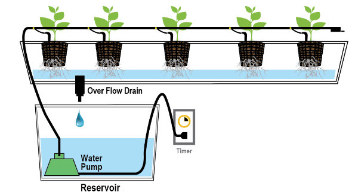

# 수경재배 (hydroponics) 란?

토양 없이 작물을 생산하는 방법을 말한다. 식물을 재배할 때 토양은 없어도 되지만, 물은 반드시 있어야 한다. 대신 식물이 필요한 양분은 물에 녹여서 공급한다. 이를 양분배양액, 양액이라고 한다. 양액은 식물 뿌리에 직접 닿게 하거나, 암면처럼 뿌리 지지체 역할을 하는 불활성매체에 양액을 적시는 방법으로 공급한다.

전통적인 농법에서는 토양은 식물뿌리의 지지체이자 식물이 필요로 하는 양분을 공급하는 역할을 한다. 반면에 수경재배 농법에서는 식물은 양분을 흙이 아니라 물로부터 직접 흡수한다. 따라서 식물이 토양으로부터 뿌리를 통해 양분을 흡수하는 데 소요되는 에너지를 절약할 수 있다. 이 에너지는 잎의 성장이나 열매를 열글게 하는 데 사용될 수 있어 성장이 촉진되는 경향이 있다.

수경재배 농법을 사용하면 농사를 지을 때 식물의 생육상황을 좀 더 완전하게 통제할 수 있다. 물, 산소, 양분 등을 세밀하게 제어함으로써 식물 생물에 필요한 양만큼 양분 공급을 최적화할 수 있기 때문이다. 이는 식물의 생육촉진뿐 아니라 출하시기를 조절할 수 있다.

수경재배 농법에는 일반적으로 두 가지 기술이 사용된다.
- 식물 뿌리가 양액에 직접 접촉하여 충분한 양분과 산소를 직접 뿌리로 공급하는 방식
- 식물 뿌리가 암면과 같은 불활성 지지체에 고정하는 방식. 뿌리를 잡고 있는 구조물은 단지 물리적인 지지체 역할만 하며 공기와 수분이 통하기 쉬운 개방형 구조를 하고 있다.

## Hydroponics System

비용을 줄이고 생산성은 극대화할 수 있도록 다양한 방식의 무토양 재배기술을 사용한다.

뿌리를 양액에 직접 담그는 방식을 **순수수경(water culture)** 이라 하고, 뿌리가 지지체에 자리 잡게 하는 방식을 **고형배지형(medium culture)** 이라 한다.

- 순수수경 (water culture)
  - 식물의 뿌리를 지지하는 지지체 없이 배양액에 직접 접촉하는 방식으로, 재배방법에 따라 담액식(DWC, deep water culture), 박막식(NFT, nutrient film technique), 분무식(aeroponics), 모관식(capillary culture) 등으로 나눈다.
- 고형배지경(medium culture)
  - 뿌리를 지탱해주는 고형 지지체가 있는 상태에서 지지체에 양액을 공급해 키우는 방법이다. 지지체의 종류에 따라 무기물 지지체와 유기물 지지체로 나눈다. 무기물 지지체로는 펄라이트, 암면, 모래, 자갈, 폴리우레탄폼, 암면, 버미큘라이트 등이 사용된다. 유기물 지지체로는 피트모스, 코코섬유, 왕겨, 훈탄 등이 널리 사용된다. 이외에도 여러 배지를 섞어 사용하는 경우도 있는 데 이를 '혼합배지경'이라 한다.

### 1. 점적관수 방식의 수경재배 (Drip System)

식물이 자라는 트레이와 양액 저장조가 분리되어 있다. 양액 공급은 개별적인 튜빙을 이용하여 연결하고, 이 튜빙의 끝에 펌프를 연결하고 다른 한 쪽은 양액을 공급받는 식물체에 위치시킨다. 양액을 공급하는 펌프는 타이머와 연결하여 저장조의 양액을 개별 식물체 위쪽에서 방울방울 떨어뜨려 공급한다. 튜브의 끝에 연결된 방사체(emitter)의 종류를 달리하여 양액을 빠르게 또는 느리게 공급 속도를 조절한다. 양액의 폐액은 다시 재순환되거나 방류한다. 이는 수경재배 시스템의 구성과 뿌리 지지체 종류에 따라 달라진다. 이때 양액이 흐르는 펌프와 튜빙은 염류나 미네랄이 축적되어 막힐 수 있으므로 정기적으로 점검하는 게 중요하다.

- 기능 - 공급되는 물의 양은 방사체의 수와 배수 속도를 달리하여 개별 식물체 별로 다르게 조절할 수 있다.
- 지지체와 친화성 - 점적관개 시스템은 어떤 종류의 지지체에도 사용 가능한 것이 특징이다. 식물 지지체에는 코코넛 섬유부터 암면, 팽화점토펠릿, 또는 특이한 형태의 토양 지지체도 사용된다.

점적관수 수경재배 방법에는 두 가지 형태가 있다.

- (회수형 점적관수 시스템) 양액을 재사용하는 시스템을 말한다. 식물 뿌리를 통과한 과량의 양액을 다시 저장조로 되돌려 보네 양분 사용 효율성을 높인다. 이 방식에서는 정기적으로 양분의 농도를 검사해야 한다. 시간이 지날수록 식물이 양분을 흡수하면서 농도가 낮아지기 때문이다.
- (비회수형 점적관수 시스템) 양액을 재사용하지 않고 흘려보내는 방식이다. 이 방식은 pH와 양분 농도를 유지하기 쉽고, 설치비가 상대적으로 적게 든다는 장점이 있다. 또한 식물 병의 전염을 최소화하는 데도 유리하다.

### 2. 간헐흐름식 수경재배 (Ebb and Flow system/Flood and Drain System)

상대적으로 설치가 간단하고 운영이 쉽기 때문에 널리 사용되는 시스템이다. 점적관수처럼 간헐흐름식은 양액으로 채워진 저장조를 별도로 사용한다. 양액은 재배상자의 뿌리가 잠기도록 펌핑을 한다. 뿌리가 잠긴 후에는 펌프가 꺼지고 재배상자의 양액은 천천히 조장조로 되돌아간다.

펌프에 달린 타이머로 펌프를 작동시켜 주기적으로 생육 트레이의 식물 뿌리가 잠기도록 양액을 공급한다. 타이머는 식물의 크기, 온도, 습도, 사용되는 지지체 등에 따라 세팅을 달리한다. 자갈과 펄라이트 등 수분을 머금지 못하는 지지체를 사용할 경우에는 보수력이 있는 지지체 - 암면, 버미큘라이트, 코코넛 섬유 에 비해 좀 더 자주 양액을 공급해줘야 한다.

유거수 필터가 저장조로 되돌아오는 물을 거르기 때문에 유지관리가 비교적 쉽다. 단점으로는 저장탱크의 양액을 자주 점검하여 최적의 양분 농도, 산소, pH 수준을 맞추어야 한다는 것이다.

### 3. 담액식 수경재배 (Water Culture System)

## reference
- https://hydroponicsgrower.org/introduction-to-different-types-of-hydroponics-systems/
- https://brunch.co.kr/@ecotown/184
